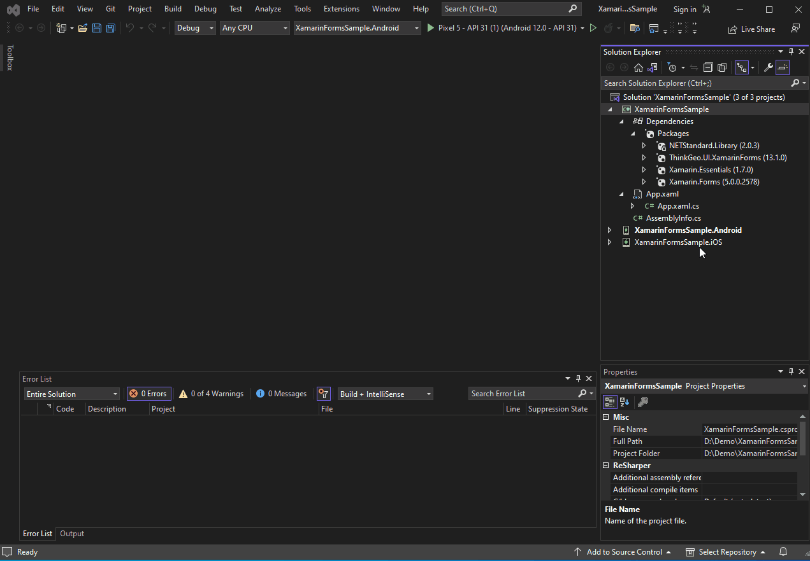

If you're new to ThinkGeo's Mobile Edition, we suggest you download ThinkGeo Maps from the App Store (for iOS) or Google Play (for Android). This app features approximately 100 'HowDoI' samples that demonstrate the capabilities of ThinkGeo's Xamarin Mapping Components. The source code of this app can be found [here](https://gitlab.com/thinkgeo/public/thinkgeo-mobile-maps/-/tree/master/samples/xamarin-forms/HowDoISample). 


App Store (For iOS)             |  Google Play (For Android)
:-------------------------:|:-------------------------:
|

## Quick Start: Display a Simple Map on Android / iOS

This guide will introduce you to ThinkGeo Mobile Maps by helping you set up a nice-looking map. By the end of this guide, you will have a basic understanding of how to use the Mobile Maps controls.

### Step 1: Set Up Prerequisites

In order to develop and debug Xamarin Android / iOS applications, you'll need to have a few prerequisites set up. 

#### Android Prerequisites

* Xamarin
* The Android SDK
* An Android emulator

Here a few handy links for installation and setup of these prerequisites using Visual Studio:

[Xamarin for Visual Studio](https://docs.microsoft.com/en-us/xamarin/get-started/installation)

[Android SDK](https://docs.microsoft.com/en-us/xamarin/android/get-started/installation/android-sdk)

[Android Emulator](https://docs.microsoft.com/en-us/xamarin/android/get-started/installation/android-emulator/device-manager)

#### iOS Prerequisites
To develop on Mac, you need:

* XCode, which provides iOS emulator.
* A development IDE, it could be Visual Studio for Mac, JetBrains Rider or others.

To develop on Windows, you need:

* A development IDE, such as Visual Studio or JetBrains Rider
* A Mac machine with XCode installed on the same network as your Windows machine.


### Step 2: Set Up a New Project

Once these prerequisites have been installed, you'll need to create a new **Xamarin Forms** project using Visual Studio.


### Step 3: Add NuGet Packages

You'll need to install the **ThinkGeo.UI.XamarinForms**, **ThinkGeo.UI.XamarinForms.Android** and **ThinkGeo.UI.XamarinForms.iOS** NuGet package. We strongly suggest you use your editor's **Manage Nuget Package** if possible.  Before adding ThinkGeo Nuget packages, you need to update the **Xamarin.Forms** Nuget Package above Version 5.0.0.2578.


### Step 4: Set up the App Template 

- Rename the **Views -> NewItemPage** to **MapPage** and move it to **XamarinFormsSample** folder



- Delete the unnecessary folders and files to make the sample clean. After the cleaning, the XamarinFormsSample project should be:


### Step 5: Add the Map Control to `MapPage.xaml`

```xml
<?xml version="1.0" encoding="utf-8" ?>
<ContentPage xmlns="http://xamarin.com/schemas/2014/forms"
             xmlns:x="http://schemas.microsoft.com/winfx/2009/xaml"
             x:Class="XamarinFormsSample.MapPage"
             xmlns:thinkgeo="clr-namespace:ThinkGeo.UI.XamarinForms;assembly=ThinkGeo.UI.XamarinForms"
             >
    <Grid>
        <thinkgeo:MapView x:Name="mapView" VerticalOptions="FillAndExpand"/>
    </Grid>
</ContentPage>
```

### Step 6: Add Namespaces and Map Background Overlay to `MapPage.xaml.cs`

- Add the required usings to the `MapPage.xaml.cs` file:

```csharp
using System.IO;
using ThinkGeo.Core;
using ThinkGeo.UI.XamarinForms;
using Xamarin.Essentials;
using Xamarin.Forms;
```
- Add the Map Background Overlay to the `MapPage.xaml.cs` file:

```csharp
namespace XamarinFormsSample
{
    public partial class MapPage : ContentPage
    {   
        public MapPage()
        {
            InitializeComponent();            
        }
        protected override async void OnAppearing()
        {
            base.OnAppearing();
            mapView.MapUnit = GeographyUnit.Meter;

            var thinkGeoCloudVectorMapsOverlay = new ThinkGeoCloudVectorMapsOverlay("9ap16imkD_V7fsvDW9I8r8ULxgAB50BX_BnafMEBcKg~", "vtVao9zAcOj00UlGcK7U-efLANfeJKzlPuDB9nw7Bp4K4UxU_PdRDg~~", ThinkGeoCloudVectorMapsMapType.Light);
            mapView.Overlays.Add(thinkGeoCloudVectorMapsOverlay);
            thinkGeoCloudVectorMapsOverlay.TileCache =
            new FileRasterTileCache(Path.Combine(FileSystem.CacheDirectory, "ThinkGeoCloudMapsOverlay"), "clientId");

            mapView.RotationEnabled = true;
            mapView.MapScale = mapView.ZoomLevelSet.ZoomLevel02.Scale;
            mapView.CenterPoint = new PointShape(0, 0);
            await mapView.RefreshAsync();
        }
    }
}
```
### Step 7: Set the MapPage to be the MainPage of the App

- Add the required usings to the `App.xaml.cs` file:

```csharp
using Xamarin.Forms;
```
- Set the MapPage to be the MainPage of the App:

```csharp
        public App()
        {
            InitializeComponent();
            MainPage = new XamarinFormsSample.MapPage();
        }
```

### Step 8: Run the Sample & Register For Your Free Evaluation

The first time you run the application, you will be presented with an error requiring a ThinkGeo license to proceed with running the app. 


In order to register and generate a license for this project, you'll need to take the following steps:

1. Open [ThinkGeo's Registration Website](https://helpdesk.thinkgeo.com/register), where you can create an account to begin a 30-day free evaluation. 
2. From there, you can download and install the Product Center and manage licenses for ThinkGeo products. For more information, please refer to the [ThinkGeo Product Center QuickStart Guide](https://cloud.thinkgeo.com/clients.html). 


### Step 9: Creating and Activating an Android / iOS License

####  Android License
1. Click on the `ThinkGeo UI Android` for Android tab and activate an evaluation license(or Activate License if you have already purchased a full license) in `ThinkGeo Product Center`.
2. To generate a runtime license for the sample app, you'll need to find the package name for your sample project. In Visual Studio, this can be found by right-clicking on the `XamarinFormsSample.Android` project in the solution explorer and navigating to `Properties -> Android Manifest -> Package Name`
3. Copy the Package Name to the Runtime License input box to the right of the Product Center and click Create. Save the newly created license to the Assets folder of the solution (`XamarinFormsSample.Android\Assets`).


4. Add the license to the project in the solution explorer by right-clicking on the `Assets` folder and selecting `Add -> Existing Item`.
5. Right-click on the license and select `Properties`. Ensure that the `Build Action` is set to `AndroidAsset`


####  iOS License
1. Click the `ThinkGeo UI iOS` for iOS tab and activate an evaluation license(or Activate License if you have already purchased a full license) in `ThinkGeo Product Center`. Now you can see a textbox with a text placeholder Bundle Identifier on the right.
2. Get the project's bundle identifier in info.plist, copy and paste it to the 'bundle dentifier' textbox in the product center.
3. Click 'Create' and save the license file (the file name would be <bundle-identifer>.mapsuitelicense) to the solution's `XamarinFormsSample.iOS` project root folder.
4. Add the license to the project in the solution explorer by right-clicking the project and selecting `Add -> Existing Item...`
5. Right-click on the license and select `Properties`. Ensure that the `Build Action` is set to `BundleResource`.

### Step 10: Show the Map

Once you activate the 'ThinkGeo UI Android' license to start your evaluation, you should be able to see the map with our Cloud Maps layer! You can double-click to zoom in, and track zoom in by holding down the Ctrl key and tracking the map.


### Android / iOS Summary

You now know the basics of using the ThinkGeo Map controls and are able to get started adding functionality to your own applications. Let's recap what we have learned about the object relationships and how the pieces of ThinkGeo UI work together:

1. It is of the utmost importance that the units (feet, meters, decimal degrees, etc.) be set properly for the Map control based on the data.
1. FeatureLayers provide the data used by a Map control to render a map.
1. A Map is the basic control that contains all of the other objects that are used to tell how the map is to be rendered.
1. A Map has many layers. A Layer correlates one-to-one with a single data source and typically of one type (point, polygon, line etc).
1. A FeatureLayer can have several ZoomLevels. ZoomLevels help to define ranges (upper and lower) of when a Layer should be shown or hidden.

You are now in a great position to look over the [other samples available](https://gitlab.com/thinkgeo/public/thinkgeo-mobile-maps/-/tree/master/samples/android) and explore our other features.

## Need Help?

If you run into any issues with running the samples, please let us know in the [Community Forums](https://community.thinkgeo.com).

If you have any questions about the product or sales, please contact us at [sales@thinkgeo.com](mailto:sales@thinkgeo.com).
