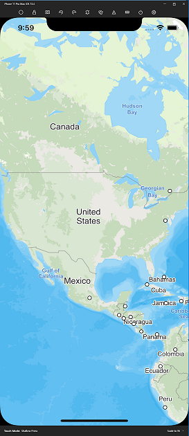
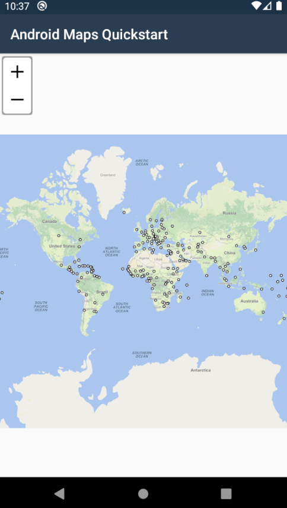

# ThinkGeo Mobile Maps 


Welcome, we're glad you're here!  If you're new to ThinkGeo's Mobile Maps, we suggest that you start by taking a look at our quickstart guide below.  This will introduce you to getting a nice looking map up and running with some external data and styling.  After reviewing this, we strongly recommend that you check out our samples for both [iOS](samples/ios) and [android](samples/android).  It's packed with examples covering nearly everything you can do with our Mobile Maps control.

## Repository Layout

`/docs`: An offline version the API documentation HTML pages.

`/samples`: A collection of feature by feature samples.

`/assets`: Any assets needed for the readme.md.

`README.md`: A quick start guide to show you how to quickly get up and running.

## Samples ##

We have a number of samples for both Android and iOS that show off ThinkGeo Mobile Maps' full capabilities. You can use these samples as a starting point for your own application, or simply reference them for how to use our controls using best practices.

- [iOS samples](samples/ios)
- [Android samples](samples/android)

## Quickstarts

- [Quick Start Guide for Android](#quick-start-display-a-simple-map-on-android)
- [Quick Start Guide for iOS](#quick-start-display-a-simple-map-on-ios)

## Quick Start: Display a Simple Map on iOS

This will introduce you to ThinkGeo Mobile Maps by getting a nice looking map up and running with ThinkGeo background map along with some external data on a Xamarin iOS application. By the end of this guide, you should have a basic understanding of how to use the Mobile Maps controls.



### Step 1: Install Prerequisites

In order to develop and debug Xamarin iOS applications, you'll need to have a few prerequisites set up.

To develop on Mac, You need:

* XCode, which provides iOS emulator.
* A development IDE, it could be Visual Studio for Mac, Xamarin Studio or others.
* Xamarin. It has been installed by default in Visual Studio for Mac or Xamarin Studio, might need to be manually installed in other IDEs.
* A provisioning profile is needed if you want to test on an iOS device.

To develop on Windows, you need:

* A Mac Machine in the same network as your build server. XCode needs to be installed on that machine.
* And on your Windows machine, you need:
  * A development IDE, such as Visual Studio or Xamarin Studio
  * Xamarin. Make sure it is well installed.

Even it sounds complicated, Microsoft in fact has made it very straightforward to connect to a MAC and develop Xamarin on Windows. So if you are a .NET developer get used to Visual Studio, feel free to stay on Windows for Xamarin development. This quick start guide is based on Visual Studio on Windows and there's no problem at all to start your application on Mac.

Here a few handy links for installation and setup of these prerequisites using Visual Studio:

[Xamarin for Visual Studio](https://docs.microsoft.com/en-us/xamarin/get-started/installation)

[Xamarin.iOS Installation](https://docs.microsoft.com/en-us/xamarin/ios/get-started/installation/)

### Step 2: Set Up a New Project

Once these prerequisites have been installed, let's create a new **iOS App (Xamarin)** project in Visual Studio and select **Single View App** template. Here is a [guide to creating a sample project](https://docs.microsoft.com/en-us/xamarin/iOS/get-started/hello-iOS/hello-iOS-quickstart) for reference.

Go ahead and run the project once it is created, and Visual Studio will help you to locate the MacOS server and initialize the connection. If everything goes well, you should see the iOS emulator get launched on Windows and the default project runs in the emulator.

### Step 3: Implement the code

Install NuGet Package `ThinkGeo.UI.iOS` to the project:

```shell
dotnet add package ThinkGeo.UI.iOS
```

Add the required usings to the ViewController.cs file:

```csharp
using ThinkGeo.Core;
using ThinkGeo.iOS.UI
```

Update `ViewDidLoad()` method in `ViewController.cs` as following:

```csharp
public override void ViewDidLoad ()
{
    base.ViewDidLoad ();
    // Perform any additional setup after loading the view, typically from a nib.

    // Creat a new MapView, which is the canvas of the map, and add it to the View.
    MapView mapView = new MapView(View.Frame);
    View.AddSubview(mapView);

    // Set the Map Unit to Meter and set the map's current extent to North America.
    mapView.MapUnit = GeographyUnit.Meter;
    mapView.CurrentExtent = new RectangleShape(-13939426, 6701997, -7812401, 2626987);

    // Create a new ThinkGeoCloud Overlay using Client ID / Client Secret, and add it the overlay to MapView.
    string clientKey = "9ap16imkD_V7fsvDW9I8r8ULxgAB50BX_BnafMEBcKg~";
    string secret = "vtVao9zAcOj00UlGcK7U-efLANfeJKzlPuDB9nw7Bp4K4UxU_PdRDg~~";
    ThinkGeoCloudVectorMapsOverlay thinkGeoCloudMapsOverlay = new ThinkGeoCloudVectorMapsOverlay(clientKey, secret);
    mapView.Overlays.Add(thinkGeoCloudMapsOverlay);

    mapView.Refresh();
}
```

### Step 4: Apply an Evaluation License for Free

Build the project and make sure it builds through. "A license is needed" exception will be thrown if you run it though and here is how to fix it:

1. Run `ThinkGeo.ProductCenter.exe` to open the product center. This can be found in the `bin` folder of the project. (`ThinkGeo.ProductCenter.exe` can only be opened on Windows, there's a CLI version for Mac.)
1. Click on `Log In` in the upper-right corner, input the username/password to login or click `Create a new account` to create a ThinkGeo account for free.
1. Once logged in, click on `ThinkGeo UI Mobile for iOS` tile and then click on `Start Evaluation`(it would be `Activate License` if you already purchased), now you can see a textbox with textholder `Bundle Identifer` on the right.
1. Now we need to generate a license for the project following the steps below:
   * Get the project's bundle identifier in `info.plist`, copy and paste it to the 'bundle dentifier' textbox in product center.
   * Hit 'Create' and save the license file (the file name would be `bundle-identifer.apsuitelicense`) to the solution's root folder.
   * Add the license to the project in the solution explorer by right-clicking the project and elect `Add -> Existing Item...`.
   * Right-click the license file in the solution explorer, select `Properties` and change the `Build Action` to `BundleResource`.

Now go ahead and run the application and the map will be displayed properly.

### Step 5: Adding an External Data Source

Now let's add an external data source (Shape File) to the map.

1. Download [WorldCapitals.zip](assets/WorldCapitals.zip) shapefile and unzip it in your project under a new folder called `SampleData`.
1. Include those files to the project. Multi-select them and change the Build Action to "Content".
1. Now add the following code to `ViewDidLoad()` method.

```csharp
// Create a new Feature Layer using the WorldCapitals.shp Shapefile.
ShapeFileFeatureLayer worldCapitalsFeatureLayer = new ShapeFileFeatureLayer("SampleData/WorldCapitals.shp");
// Set the pointstyle to black circle with the size of 8.
worldCapitalsFeatureLayer.ZoomLevelSet.ZoomLevel01.DefaultPointStyle = PointStyle.CreateSimpleCircleStyle(GeoColors.White, 8, GeoColors.Black);
// Apply the point style from zoomlevel01 to zoomlevel20, that's accross all the zoomlevels.
worldCapitalsFeatureLayer.ZoomLevelSet.ZoomLevel01.ApplyUntilZoomLevel = ApplyUntilZoomLevel.Level20;

// Convert the world capital featurelay from DecimalDegrees, which is the projection of the raw data, to Spherical Mercator, which is the projection of the map.
worldCapitalsFeatureLayer.FeatureSource.ProjectionConverter = new ProjectionConverter(Projection.GetDecimalDegreesProjString(), Projection.GetSphericalMercatorProjString());

// Add the Layer to an Overlay and add the overlay to the map.
LayerOverlay layerOverlay = new LayerOverlay();
layerOverlay.Layers.Add(worldCapitalsFeatureLayer);
mapView.Overlays.Add(layerOverlay);
```

### iOS Summary

You now know the basics of using the ThinkGeo Map controls and are able to get started adding functionality into your own applications. Let's recap what we have learned about the object relationships and how the pieces of ThinkGeo UI work together:

1. It is of the utmost importance that the units (feet, meters, decimal degrees, etc.) be set properly for the Map control based on the data.
1. FeatureLayers provide the data used by a Map control to render a map.
1. A Map is the basic control that contains all of the other objects that are used to tell how the map is to be rendered.
1. A Map has many layers. A Layer correlates one-to-one with a single data source and typically of one type (point, polygon, line etc).
1. A FeatureLayer can have several ZoomLevels. ZoomLevels help to define ranges (upper and lower) of when a Layer should be shown or hidden.

You are now in a great position to look over the [other samples available](https://gitlab.com/thinkgeo/public/thinkgeo-mobile-maps/-/tree/develop/samples/ios) and explore our other features.

## Quick Start: Display a Simple Map on Android

This will introduce you to ThinkGeo Mobile Maps by getting a nice looking map up and running with some external data and styling on a Xamarin Android application. By the end of this guide, you should have a basic understanding of how to use the Mobile Maps controls.



### Step 1: Set Up Prerequisites

In order to develop and debug Xamarin Android applications, you'll need to have a few prerequisites set up. These include:

* Xamarin
* The Android SDK
* An Android emulator

Here a few handy links for installation and setup of these prerequisites using Visual Studio:

[Xamarin for Visual Studio](https://docs.microsoft.com/en-us/xamarin/get-started/installation)

[Android SDK](https://docs.microsoft.com/en-us/xamarin/android/get-started/installation/android-sdk)

[Android Emulator](https://docs.microsoft.com/en-us/xamarin/android/get-started/installation/android-emulator/device-manager)

### Step 2: Set Up a New Project

Once these prerequisites have been installed, you'll need to create a new **Xamarin Android** project in your editor of choice. Please refer to your editor's instructions on how to create this project. Here is a [guide to creating a sample project](https://docs.microsoft.com/en-us/xamarin/android/get-started/hello-android/hello-android-quickstart) using Visual Studio for reference.

### Step 3: Add NuGet Packages

You'll need to install the **ThinkGeo.UI.Android** NuGet package. We strongly suggest you use your editor's [built in NuGet package manager](https://docs.microsoft.com/en-us/nuget/quickstart/) if possible.  If you're not using an IDE you can [install it via the the dotnet CLI](https://docs.microsoft.com/en-us/nuget/consume-packages/install-use-packages-dotnet-cli) from inside the project folder where your project file exists.

```shell
dotnet add package ThinkGeo.UI.Android
```

### Step 4: Set up the App Template and add the MapView element

Open up the main app layout file. In Visual Studio, this should be under the path `Resources\layout\activity_main.axml`, and add the `ThinkGeo.UI.Android.MapView` element

```xml
<?xml version="1.0" encoding="utf-8"?>
<RelativeLayout xmlns:android="http://schemas.android.com/apk/res/android"
    xmlns:app="http://schemas.android.com/apk/res-auto"
    xmlns:tools="http://schemas.android.com/tools"
    android:layout_width="match_parent"
    android:layout_height="match_parent">
    <ThinkGeo.UI.Android.MapView
        android:id="@+id/androidMap"
        android:layout_width="fill_parent"
        android:layout_height="fill_parent" />
</RelativeLayout>
```

### Step 5: Add Namespaces to MainActivity.cs

Add the required usings to the MainActivity.cs file:

```csharp
using ThinkGeo.Core;
using ThinkGeo.UI.Android;
```

### Step 6: Add the Map Background Overlay

Create a new method called `ShowMap` in the MainActivity.cs file, and add the code below:

```csharp
public void ShowMap()
{
    // Set our view from the "main" layout resource
    SetContentView(Resource.Layout.activity_main);

    MapView androidMap = FindViewById<MapView>(Resource.Id.androidMap);

    // Set the Map Configuration.
    androidMap.MapUnit = GeographyUnit.Meter;
    androidMap.ZoomLevelSet = new ThinkGeoCloudMapsZoomLevelSet();
    androidMap.CurrentExtent = new RectangleShape(-20000000, 20000000, 20000000, -20000000);

    // Add the Cloud Maps Overlay
    ThinkGeoCloudRasterMapsOverlay thinkGeoCloudMapsOverlay = new ThinkGeoCloudRasterMapsOverlay("9ap16imkD_V7fsvDW9I8r8ULxgAB50BX_BnafMEBcKg~", "vtVao9zAcOj00UlGcK7U-efLANfeJKzlPuDB9nw7Bp4K4UxU_PdRDg~~");

    androidMap.Overlays.Add("CloudRasterMapsOverlay", thinkGeoCloudMapsOverlay);
}
```

Then, remove the `SetContentView` call and call this method from the `OnCreate` method in the MainActivity.cs file:

```csharp
// Remove this call from 'OnCreate'
// SetContentView(Resource.Layout.activity_main);

// Add this call to the 'OnCreate' method
ShowMap();
```

### Step 7: Run the Sample & Register For Your Free Evaluation

The first time you run the application, you will be presented with an error requiring a ThinkGeo license to proceed with running the app. In order to register and generate a license for this project, you'll need to perform the following steps:

1. Run the ThinkGeo.ProductCenter.exe to open the product center. This can be found in the `bin` folder of your project at `path\to\project\bin\Debug\`.
1. Click on `Log In` in the upper-right corner and `Create a new account`
1. Follow the steps on the website to register for your account
1. Return to Product Center and log in using your new credentials.
1. Click on the `ThinkGeo UI Mobile for Android` tab and activate an evaluation license.
1. To generate a runtime license for the sample app, you'll need to find the package name for your sample project. In Visual Studio, this can be found by right-clicking on the project in the solution explorer and navigating to `Properties -> Android Manifest -> Package Name`
1. Copy the `Package Name` to the `Runtime License` input box to the right of the Product Center and click `Create`. Save the mewly created license to the `Assets` folder of the solution (`path\to\project\Assets`).
1. Add the license to the project in the solution explorer by right-clicking on the `Assets` folder and selecting `Add -> Existing Item`.
1. Right-click on the license and select `Properties`. Ensure that the `Build Action` is set to `AndroidAsset`

You should now be able to see your app with our Cloud Maps layer!

### Step 8: Adding an External Data Source - Requesting Permissions

Now that you have the basic map set up, you can add custom data to the map. Depending on the data, this can be complex or quite simple. We'll be going over the simple basics of adding custom data.

Download the [WorldCapitals.zip](assets/WorldCapitals.zip) shapefile data and unzip it in your project under a new folder in the `Assets` folder called `AppData`. In order to move this data into storage on the Android device, we'll need to set up our app to request some basic permissions as well.

First, we need to add the required permissions to the Android manifest. This can be done by right-clicking on the project in the solution explorer and navigating to `Properties -> Android Manifest`, and finding `Required Permissions` near the bottom of the page. We need to ensure that the `READ_EXTERNAL_STORAGE` and `WRITE_EXTERNAL_STORAGE` options are checked.

Next, we need to set up the method to request permissions. Add the following fields to your MainActivity class:

```csharp
readonly string[] StoragePermissions =
{
    Manifest.Permission.ReadExternalStorage,
    Manifest.Permission.WriteExternalStorage
};
const int RequestStorageId = 0;
```

Add the following usings:

```csharp
using Android;
using Android.Content.PM;
```

Then, add the following method to your MainActivity.cs class. This method will handle requesting permissions:

```csharp
public void RequestRequiredPermissions()
{
    const string readPermission = Manifest.Permission.ReadExternalStorage;
    const string writePermission = Manifest.Permission.WriteExternalStorage;

    if (!(CheckSelfPermission(readPermission) == (int)Permission.Granted) || !(CheckSelfPermission(writePermission) == (int)Permission.Granted))
    {
        RequestPermissions(StoragePermissions, RequestStorageId);
    }
    else
    {
        ShowMap();
    }
}
```

Add the following code to the `OnRequestPermissionsResult` method in the `MainActivity.cs`:

```csharp
public override void OnRequestPermissionsResult(int requestCode, string[] permissions, [GeneratedEnum] Permission[] grantResults)
{
    switch (requestCode)
    {
        case RequestStorageId:
            {
                if(grantResults.Length > 0 && grantResults[0] == Permission.Granted)
                {
                    ShowMap();
                }
                else
                {
                    Toast.MakeText(this,
                        "Storage Permissions Denied", ToastLength.Short).Show();
                }
            }
            break;
    }
}
```

Finally, replace the `ShowMap` call in the `OnCreate` method with a call to the `RequestRequiredPermissions` method:

```csharp
// Replace 'ShowMap()' in the 'OnCreate' method
RequestRequiredPermissions();
```

### Step 9: Adding an External Data Source - Importing Data

Now that we have storage permissions set up, we can store the data locally on the Android device. Create a new folder named `SampleData` under the `Assets` folder in the solution, then add the map data to it. Make sure the resources’ build action is `AndroidAsset`.

Now, we can add a method to copy the data to the external storage for the application to use.

```csharp
private void CopySampleData(string targetDirectory)
{
    if (!Directory.Exists(targetDirectory)) Directory.CreateDirectory(targetDirectory);

    foreach (string filename in Assets.List("SampleData"))
    {
        string sourcePathFilename = Path.Combine("SampleData", filename);
        string targetPathFilename = Path.Combine(targetDirectory, filename);
        if (!File.Exists(targetPathFilename))
        {
            string targetPath = Path.GetDirectoryName(targetPathFilename);
            if (!Directory.Exists(targetPath)) Directory.CreateDirectory(targetPath);
            Stream sourceStream = Assets.Open(sourcePathFilename);
            FileStream fileStream = File.Create(targetPathFilename);
            sourceStream.CopyTo(fileStream);
            fileStream.Close();
            sourceStream.Close();
        }
    }
}
```

Now we can call this method when we initialize our map, in the `ShowMap` method.

```csharp
public void ShowMap()
{
    // Set our view from the "main" layout resource
    SetContentView(Resource.Layout.activity_main);
    // Copy the required Shapefiles to Device.
    string targetDirectory = Path.Combine(Environment.ExternalStorageDirectory.ToString(), "SampleData");
    CopySampleData(targetDirectory);
```

This method will copy data to the target path, if the folder does not exist.

### Step 10: Add a Point Data Layer

Now we can add the data from the shapefile to the map, in the `ShowMap()` method:

```csharp
// Add a shapefile layer with point style.
var capitalLayer = new ShapeFileFeatureLayer(Path.Combine(Environment.ExternalStorageDirectory.ToString(), @"SampleData/WorldCapitals.shp"));

// Create an overlay to add the layer to and add that overlay to the map.
var customDataOverlay = new LayerOverlay();
customDataOverlay.Layers.Add(capitalLayer);
androidMap.Overlays.Add(customDataOverlay);
```

### Step 11: Styling and Labeling the Data

We won't be able to see the points until a style is defined for it. Adding a style is very straightforward, but extremely extensible and powerful.

```csharp
var capitalStyle = new PointStyle()
{
    SymbolType = PointSymbolType.Circle,
    SymbolSize = 8,
    FillBrush = new GeoSolidBrush(GeoColors.White),
    OutlinePen = new GeoPen(GeoColors.Black, 2)
};

capitalLayer.ZoomLevelSet.ZoomLevel01.DefaultPointStyle = capitalStyle;
capitalLayer.ZoomLevelSet.ZoomLevel01.ApplyUntilZoomLevel = ApplyUntilZoomLevel.Level20;
```

### Step 12: Reprojecting the Data

If you run the app now, you'll notice that there is just a single point shape in the center of the map! This is because the data is in a completely different projection from the map. We can easily fix that, though, by adding a `ProjectionConverter` to the layer from Decimal Degrees(4326) to Spherical Mercator(3857).

```csharp
// Set the projection of the capitalLayer to Spherical Mercator
capitalLayer.FeatureSource.ProjectionConverter = new ProjectionConverter(4326, 3857);
```

Now, the data shows up properly on the map!

### Step 13: Zoom Into the Data

Now, we can make the map zoom into an area based on the extent of the data we added above. In order to do that, we must first open the layer for spatial queries to be made.

```csharp
// Open capitalLayer for it to be ready for spatial queries. Then, set the extent of the map to the full view of the data.
capitalLayer.Open();
mapView.CurrentExtent = capitalLayer.GetBoundingBox();
```

### Android Summary

You now know the basics of using the ThinkGeo Map controls and are able to get started adding functionality into your own applications. Let's recap what we have learned about the object relationships and how the pieces of ThinkGeo UI work together:

1. It is of the utmost importance that the units (feet, meters, decimal degrees, etc.) be set properly for the Map control based on the data.
1. FeatureLayers provide the data used by a Map control to render a map.
1. A Map is the basic control that contains all of the other objects that are used to tell how the map is to be rendered.
1. A Map has many layers. A Layer correlates one-to-one with a single data source and typically of one type (point, polygon, line etc).
1. A FeatureLayer can have several ZoomLevels. ZoomLevels help to define ranges (upper and lower) of when a Layer should be shown or hidden.

You are now in a great position to look over the [other samples available](https://gitlab.com/thinkgeo/public/thinkgeo-mobile-maps/samples/android) and explore our other features.

## Need Help?

If you run into any issues with running the samples, please let us know in the [Community Forums](https://community.thinkgeo.com).

If you have any questions about the product or sales, please contact us at [sales@thinkgeo.com](mailto:sales@thinkgeo.com).

