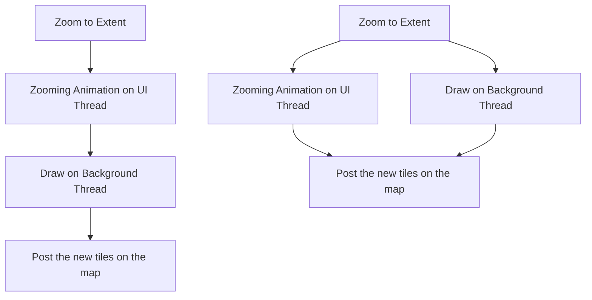
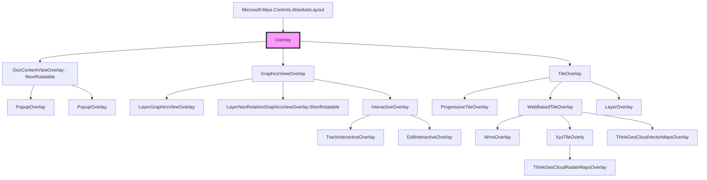

# ThinkGeo Maui Maps

This repository is dedicated to providing samples and documentation for ThinkGeo's MAUI Components. ThinkGeo MAUI's official release date was May 1st, 2024, coinciding with the end of Microsoft's support for Xamarin.

We are continuously making improvements to the SDK / adding more samples. 

## ThinkGeo Maui HowDoI Sample:
#### Design Philosophy: Streamlined for Simplicity
1. Avoids the use of MVVM patterns
2. Excludes third-party NuGet packages
3. Initializes by copying sample data to the AppData folder on first run
    - Ensures data consistency across platforms
    - Optimizes compatibility with ThinkGeo APIs
4. Implementation Notes:
    - No modifications needed in the Platforms folder; stick to default settings.
    - Retain default settings in MauiProgram.cs.
    - Contains comments to suppress Resharper warnings.

### Development Environment Compatibility
- **Visual Studio on Windows**: Target options include Windows, Android, and iOS (via a connected Mac machine).
- **Rider on MacOS**: Supports targeting iOS, Android, and MacCatalyst.

## ThinkGeo.UI.Maui Key Features 

### 1. Comprehensive Support for Multiple Platforms

1. Requires .Net 8.0
2. Supports iOS, Android, Windows, and MacCatalyst platforms
3. Relies on the same ThinkGeo.Core as other ThinkGeo products
4. Easy to use, no need to write platform specific code. 
5. Currently in beta. Version 13.3 will be aligned with other ThinkGeo products by May 1st, 2024.

### 2. Live XAML Updates (Visual Studio)
Observe real-time changes in XAML during development.

### 3. Enhanced Animation Capabilities

Each zooming function is awaitable and supports various AnimationSettings, including:
- **AnimationLength**: Defaults to 150 milliseconds.
- **EasingType**: Set to CubicInOut by default.
- **AnimationType**: Enum with two options—DrawAfterAnimation (default) and DrawWithAnimation. Below is a diagram illustrating the difference between these two options.

Customize default AnimationSettings or apply specific settings to individual methods.

## 4. Responsive and Flexible APIs
- Awaitable Methods: Every zooming method is awaitable and supports CancellationToken for operation cancellation. This responsiveness extends to system operations like map double-tapping.
- Debugging Tools: Access internal information for debugging purposes.
- Enhanced Control: Utilize the OverlaysRenderSequenceType enum to control whether overlays are rendered sequentially or concurrently.

## Transition Guidance for Existing ThinkGeo Users

- Seamless transition with the same ThinkGeo.Core.
- From CurrentExtent to CenterPoint, Scale, and RotationAngle.
- Transition from MapView.ZoomLevelSet to TileOverlay.ZoomLevelSet.
- Increased reliance on XAML and data binding for map configurations.

## Overlays

