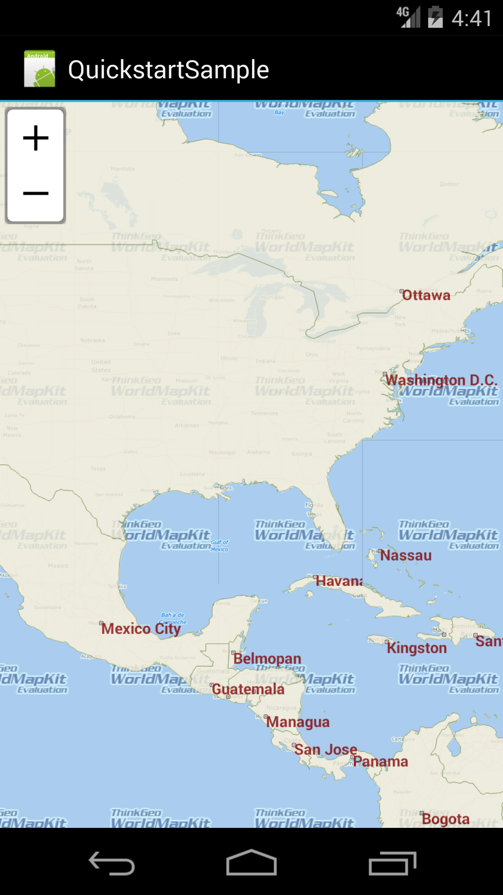
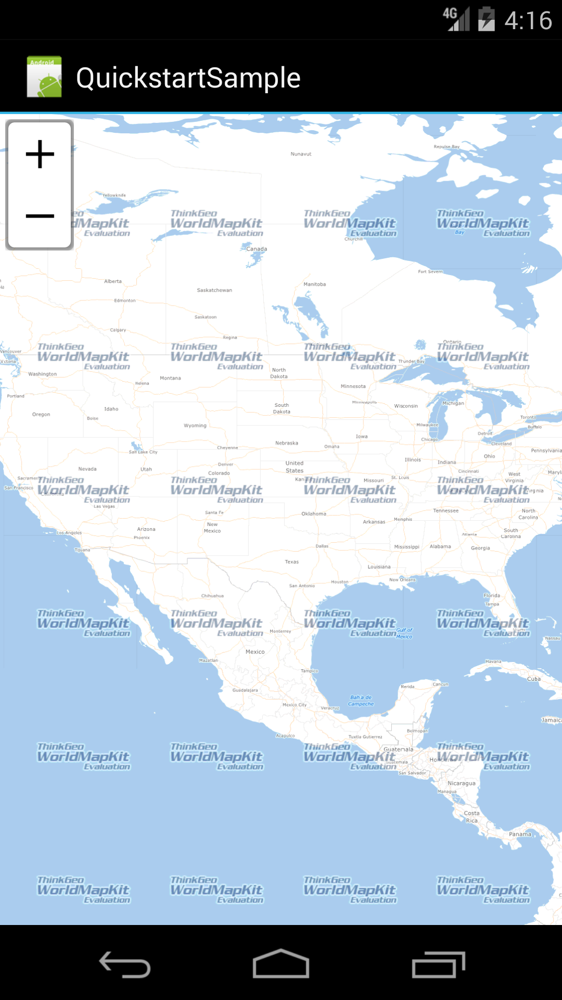
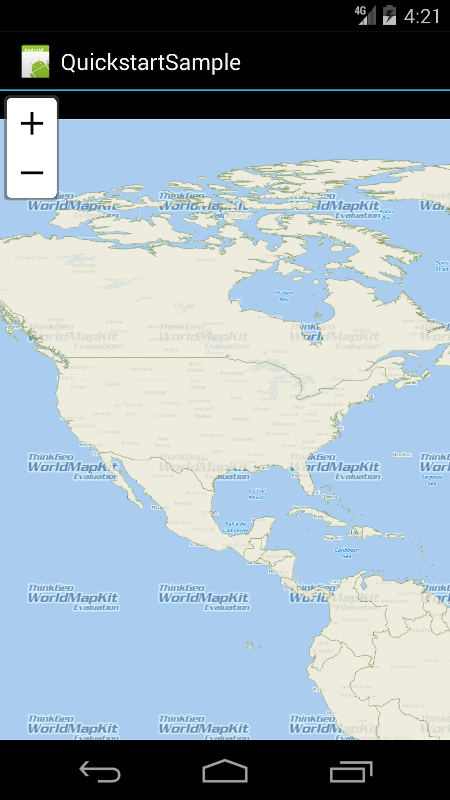

# ThinkGeo Mobile Maps 


> Pardon Our Mess: We are currently in a state of transition to moving from our [old wiki](), [discussion forums](), and [GitHub repos]() to GitLab. As a result, certain aspects of our documents may be in disarray. Ultimately, we believe that having a unified location for our customers to discover and explore our products will lead to less confusion and better satisfaction. Until then, if you have any questions or feedback, please reach out to us at [sales@thinkgeo.com](mailto:sales@thinkgeo.com).

Welcome, we're glad you're here!  If you're new to ThinkGeo's Mobile Maps, we suggest that you start by taking a look at our quickstart guide below.  This will introduce you to getting a nice looking map up and running with some external data and styling.  After reviewing this, we strongly recommend that you check out our samples for both [iOS](samples/ios) and [android](samples/android).  It's packed with examples covering nearly everything you can do with our Mobile Maps control.


## Samples ##

We have a number of samples for both Android and iOS that show off ThinkGeo Mobile Maps' full capabilities. You can use these samples as a starting point for your own application, or simply reference them for how to use our controls using best practices.

* [iOS samples](samples/ios)
* [Android samples](samples/android)


## Display a Simple Map ##

This will introduce you to ThinkGeo Mobile Maps by getting a nice looking map up and running with some external data and styling on a Xamarin Android application. By the end of this guide, you should have a basic understanding of how to use the Mobile Maps controls.



> You can get the full example project for this guide [here](samples/android/GettingStartedSample/)


### Setting up the Environment ###

Let's start by creating a new Android project in Microsoft Visual Studio (2012 or newer) named QuickstartSample. We can create the project with .NET Framework 4.5.

The project QuickstartSample is created in a new solution called QuickstartSample. The wizard creates a single Android Application. Choose Android version (4.0.3 or higher) for the project.

Now we are going to install ThinkGeo Mobile Maps for Android NuGet package. Let's open NuGet Manager dialog and install following NuGet package: `MapSuiteMobileForAndroid-Standard`.


### Add the MapView to our App ###

Open the Resources\layout\Main.axml file. Remove the default button node, and insert MapView node in the axml.

```xml
<?xml version="1.0" encoding="utf-8"?>
<LinearLayout xmlns:android="http://schemas.android.com/apk/res/android"
    android:orientation="vertical"
    android:layout_width="fill_parent"
    android:layout_height="fill_parent">
    <ThinkGeo.MapSuite.Android.MapView
        android:id="@+id/MapView"
        android:layout_width="fill_parent"
        android:layout_height="fill_parent"/>
</LinearLayout>
```

Now we have our `ThinkGeo.MapSuite.Android.dll` and `ThinkGeo.MapSuite.dll` referenced and a MapView added.


### Displaying the World Map ###

Now the project is ready, Map Suite Runtime license is required for running and debugging your product. Please open the Product Center, then generate your license. For more details, please refer to (http://wiki.thinkgeo.com/wiki/map_suite_runtime_license_guide_for_mobile).

Let's add references to the `ThinkGeo.MapSuite`, `ThinkGeo.MapSuite.Android` and `ThinkGeo.MapSuite.Shapes` namespaces at the very top of our code, since we'll use many classes within them. 

```csharp
using ThinkGeo.MapSuite;
using ThinkGeo.MapSuite.Android;
using ThinkGeo.MapSuite.Shapes;
```

Now, Let's add a base overlay to display the world map witch called "WorldStreetsAndImageryOverlay".

```csharp
protected override void OnCreate(Bundle bundle)
{
    base.OnCreate(bundle);
    SetContentView(Resource.Layout.Main);

    // Get MapView From Activity's View.
    MapView mapView = FindViewById<MapView>(Resource.Id.MapView);

    // Set the Map Unit to DecimalDegrees, the Shapefile’s unit of measure. 
    mapView.MapUnit = GeographyUnit.DecimalDegree;
            
    // Create a WorldStreetsAndImageryOverlay.
    WorldStreetsAndImageryOverlay worldStreetsAndImageryOverlay = new WorldStreetsAndImageryOverlay();

    // Add a WorldStreetsAndImageryOverlay .
    mapView.Overlays.Add("WorldStreetsAndImageryOverlay", worldStreetsAndImageryOverlay);
    
    // Set a proper extent for the map. The extent is the geographical area you want it to display.
    mapView.CurrentExtent = new RectangleShape(-134, 70, -56, 7);
}
```




### Run the Sample & Register for Your Free Evaluation ###

The first time you run your application, you will be presented with ThinkGeo's Product Center which will create and manage your licenses for all of ThinkGeo's products. Create a new account to begin a 60-day free evaluation. 

1. Run the application in Debug mode.
1. Click the "Create a new Account?" link.
1. Fill out your name, email address, password and company name and click register.
1. Check your email and click the "Active Your Account" link.
1. Return to Product Center and login using the credentials your just created and hit "Continue Debugging" button.

You should now see your map with our Cloud Maps layer!


### Adding Your Own Data to the Map ###

Next, we will go over how to add your own external data and add it to the map. We've provided some sample shapefile data for you to use [here](samples/android/GettingStartedSample/GettingStarted/Assets/SampleData).

Create a new folder named AppData under "Assets", then add the map data to it. Make sure the resources’ build action is AndroidAsset.

Now, we can use code to copy the data to a special location for the Android application to use.

```csharp
protected override void OnCreate(Bundle bundle)
{
    base.OnCreate(bundle);
    SetContentView(Resource.Layout.Main);

    // Copy the required Shapefiles to Device.
    string targetDirectory = (@"/mnt/sdcard/Android.Sample/GetStarted/");
    CopySampleData(targetDirectory);
}
```

This method will copy data to the target path, if the folder does not exist. 

```csharp
private void CopySampleData(string targetDirectory)
{
	if (!Directory.Exists(targetDirectory))
	{
		Directory.CreateDirectory(targetDirectory);
		foreach (string filename in Assets.List("AppData"))
		{
			Stream stream = Assets.Open("AppData/" + filename);
			FileStream fileStream = File.Create(Path.Combine(targetDirectory, filename));
			stream.CopyTo(fileStream);
			fileStream.Close();
			stream.Close();
		}
	}
}
```

Our next step is to define and add our layers. All of the following code can be placed in the "OnCreate" method of the MainActivity.cs so our MapView can load and render the data. We can also add logic to check the data to avoid coping it every time.

```csharp
protected override void OnCreate(Bundle bundle)
{
    base.OnCreate(bundle);
    SetContentView(Resource.Layout.Main);

    // Copy the required ShapeFiles to Device.
    string targetDirectory = (@"/mnt/sdcard/Android.Sample/GetStarted/");
    CopySampleData(targetDirectory);

    MapView mapView = FindViewById<MapView>(Resource.Id.MapView);
    mapView.MapUnit = GeographyUnit.DecimalDegree;

    // Create a WorldStreetsAndImageryOverlay.
    WorldStreetsAndImageryOverlay worldStreetsAndImageryOverlay = new WorldStreetsAndImageryOverlay();

    // Add a WorldStreetsAndImageryOverlay .
    mapView.Overlays.Add("WorldStreetsAndImageryOverlay", worldStreetsAndImageryOverlay);
    
    // We create a new Layer and pass the path to a Shapefile into its constructor.
    ShapeFileFeatureLayer worldLayer = new ShapeFileFeatureLayer(Path.Combine(targetDirectory, "Countries02.shp"));

    // Set the worldLayer with a preset Style, as AreaStyles.Country1 has a YellowGreen background and black border, our worldLayer will have the same render style.
    worldLayer.ZoomLevelSet.ZoomLevel01.DefaultAreaStyle = AreaStyles.Country1;

    // This setting will apply from ZoomLevel01 to ZoomLevel20, which means the map will be rendered with the same style no matter how far we zoom in or out.
    worldLayer.ZoomLevelSet.ZoomLevel01.ApplyUntilZoomLevel = ApplyUntilZoomLevel.Level20;

    // We need to create a LayerOverlayer to add the world layer.
    LayerOverlay overlay = new LayerOverlay();
    overlay.Opacity = 0.8;
    overlay.Layers.Add(worldLayer);

    mapView.Overlays.Add("Countries02", overlay);

    mapView.CurrentExtent = new RectangleShape(-134, 70, -56, 7);
}
```

If we compile and run what we have now, our map should have the countries polygons overlaid on top of our base map.



> So what has occurred here? We have created a layer and added it to the map and the map has rendered according to its default style parameters. Also, we have used ZoomLevel to display the map the way that we want.

> **NOTE:** It is important that the "MapUnit" property of a Map object be set using the "GeographyUnit" enumeration. This is because the coordinates stored in a ShapeFile can be in DecimalDegrees (a format of latitude and longitude), feet, meters, or another unit system. Our map has no way to know what the ShapeFile's unit of measurement is until we set it. This information is normally found somewhere in the ShapeFile's documentation (also referred to as its metadata), or within its supplemental data file, as discussed in the section on ShapeFiles. It may also come as a separate .txt, .xml, or .html file that begins with the same file name as the main ShapeFile.

That was an easy start! Now, let's add second ShapeFile to the sample, so we'll have a total of two layers:

* World country borders (`Countries02.shp`)
* World capitals (`capital.shp`)

```csharp
protected override void OnCreate(Bundle bundle)
{
    base.OnCreate(bundle);
    SetContentView(Resource.Layout.Main);

    string targetDirectory = (@"/mnt/sdcard/Android.Sample/GetStarted/");
    CopySampleData(targetDirectory);

    MapView mapView = FindViewById<MapView>(Resource.Id.MapView);
    mapView.MapUnit = GeographyUnit.DecimalDegree;

    // Create a WorldStreetsAndImageryOverlay.
    WorldStreetsAndImageryOverlay worldStreetsAndImageryOverlay = new WorldStreetsAndImageryOverlay();

    // Add a WorldStreetsAndImageryOverlay .
    mapView.Overlays.Add("WorldStreetsAndImageryOverlay", worldStreetsAndImageryOverlay);

    ShapeFileFeatureLayer worldLayer = new ShapeFileFeatureLayer(Path.Combine(targetDirectory, "Countries02.shp"));
    worldLayer.ZoomLevelSet.ZoomLevel01.DefaultAreaStyle = AreaStyles.Country1;
    worldLayer.ZoomLevelSet.ZoomLevel01.ApplyUntilZoomLevel = ApplyUntilZoomLevel.Level20;

    // Similarly, we use the presetPointStyle for cities.
    ShapeFileFeatureLayer capitalLayer = new ShapeFileFeatureLayer(Path.Combine(targetDirectory, "capital.shp"));

    // These settings will apply from ZoomLevel01 to ZoomLevel20, which means city symbols will be rendered in the same style, no matter how far we zoom in or out.
    capitalLayer.ZoomLevelSet.ZoomLevel01.DefaultPointStyle = PointStyles.Capital3;

    // We need to add both of the new layers to the Map's Static Overlay.
    capitalLayer.ZoomLevelSet.ZoomLevel01.ApplyUntilZoomLevel = ApplyUntilZoomLevel.Level20;

    // We need to create a LayerOverlay to add the world layer.
    LayerOverlay overlay = new LayerOverlay();
    overlay.Opacity = 0.8;
    overlay.Layers.Add(worldLayer);
    overlay.Layers.Add(capitalLayer);

    mapView.Overlays.Add("Countries02", overlay);

    mapView.CurrentExtent = new RectangleShape(-134, 70, -56, 7);
}
```

Running the application again will show you points on the map indicating the locations of all the capitol cities of the world. But, it's not very useful to just show them as points! Let's show you how to add labels to these cities using a TextStyle.

A TextStyle ​is used to label items on map. As every ShapeFile ​has a relative .dbf file that includes descriptions for every record, the most common way to use TextStyles is for labeling. For example, Capital ShapeFile'​s corresponding .dbf file contains the field "​CITY_NAME"​. We can use this field to label the cities on our map.

Map Suite includes several built-in TextStyles to help us quickly apply attractive city labels. We can simply pick the TextStyle we like and use it.


```csharp
protected override void OnCreate(Bundle bundle)
{
    base.OnCreate(bundle);
    SetContentView(Resource.Layout.Main);

    string targetDirectory = (@"/mnt/sdcard/Android.Sample/GetStarted/");
    CopySampleData(targetDirectory);

    MapView mapView = FindViewById<MapView>(Resource.Id.MapView);
    mapView.MapUnit = GeographyUnit.DecimalDegree;

    WorldStreetsAndImageryOverlay worldStreetsAndImageryOverlay = new WorldStreetsAndImageryOverlay();
    mapView.Overlays.Add("WorldStreetsAndImageryOverlay", worldStreetsAndImageryOverlay);        

    ShapeFileFeatureLayer worldLayer = new ShapeFileFeatureLayer(Path.Combine(targetDirectory, "Countries02.shp"));
    worldLayer.ZoomLevelSet.ZoomLevel01.DefaultAreaStyle = AreaStyles.Country1;
    worldLayer.ZoomLevelSet.ZoomLevel01.ApplyUntilZoomLevel = ApplyUntilZoomLevel.Level20;

    ShapeFileFeatureLayer capitalLayer = new ShapeFileFeatureLayer(Path.Combine(targetDirectory, "capital.shp"));
    capitalLayer.ZoomLevelSet.ZoomLevel01.DefaultPointStyle = PointStyles.Capital3;
    capitalLayer.ZoomLevelSet.ZoomLevel01.ApplyUntilZoomLevel = ApplyUntilZoomLevel.Level20;

    // We create a new Layer for labeling the capitals.
    ShapeFileFeatureLayer capitalLabelLayer = new ShapeFileFeatureLayer(Path.Combine(targetDirectory, "capital.shp"));
    // We use the preset TextStyle. Here we pass in the “CITY_NAME”, the name of the field containing the values we want to label the map with.
    capitalLabelLayer.ZoomLevelSet.ZoomLevel01.DefaultTextStyle = TextStyles.Capital3("CITY_NAME");
    capitalLabelLayer.ZoomLevelSet.ZoomLevel01.ApplyUntilZoomLevel = ApplyUntilZoomLevel.Level20;
  
    LayerOverlay overlay = new LayerOverlay();
    overlay.Opacity = 0.8;
    overlay.Layers.Add(worldLayer);
    overlay.Layers.Add(capitalLayer);
    // Add the label layer to LayerOverlay.
    overlay.Layers.Add(capitalLabelLayer);

    mapView.Overlays.Add("Countries02", overlay);

    mapView.CurrentExtent = new RectangleShape(-134, 70, -56, 7);
}
```


### Summary ###

You now know the basics of using the ThinkGeo Mobile Map control and can start adding this functionality to your own applications. Let's recap what we've learned about the object relationships and how the pieces of Map Suite work together:

* It is of the utmost importance that the units (feet, meters, decimal degrees, etc.) be set properly for the Map control, based on the requirements of your data.
* Shapefiles provide the data used by a Map control to render a map.
* A Map is the basic control that contains all the other objects used to indicate how the map should be rendered.
* A Map has one-to-many Layers. A Layer correlates one-to-one with a Shapefile (.shp).
* A Layer can have one-to-many ZoomLevels. ZoomLevels help to define ranges (upper and lower scales) of when a Layer should be shown or hidden.

For a further in-depth look at other features of Mobile Maps, this repo contains plenty of samples to help you along for both Android and iOS. 

## Need Help? ##

If you run into any issues with running the samples, please create a new issue in the issue tracker. 

If you have any questions about the product or sales, please contact us at [sales@thinkgeo.com](mailto:sales@thinkgeo.com).
