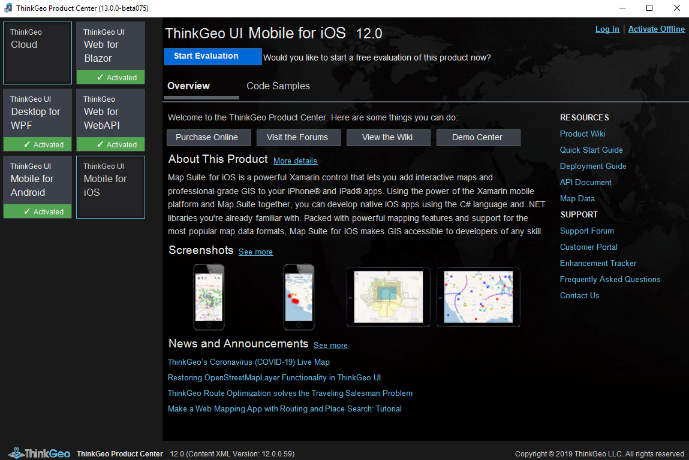
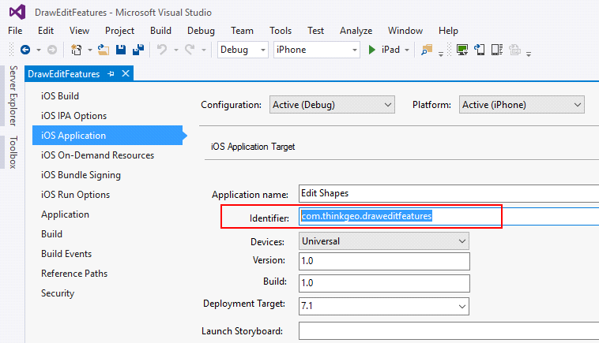
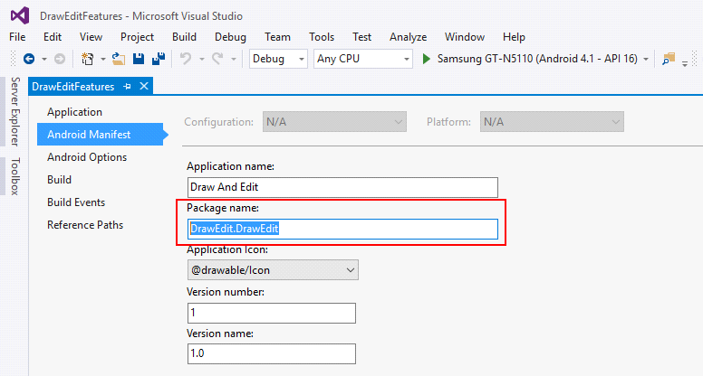
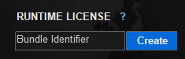
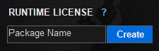
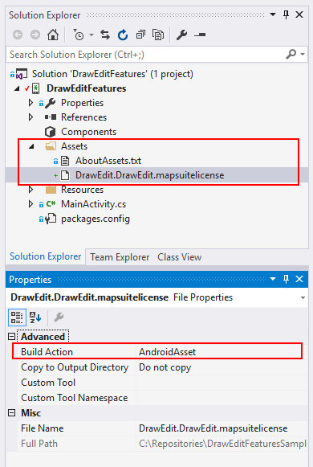

# Deployment

When debugging or running a mobile app with ThinkGeo UI Mobile Components, you'll need to generate a runtime license to include with your application, or it won't run.

## Generating a Runtime License using the ThinkGeo Product Center

A new runtime license for your application can be generated using the ThinkGeo Product Center. If you've already created and built a project using the ThinkGeo Mobile components, you can find the `ThinkGeo.ProductCenter.exe` file in your application's `bin` folder. Or, you can download the product center using link below:

[Download ThinkGeo Product Center 12](assets/ThinkGeoProductCenter12.zip) _(1.9 MB)_

Once you've opened up product center, navigate to either the Android or iOS tab like shown:

Figure 1. ThinkGeo Product Center with the iOS tab selected

### Activate or Start a Trial with ThinkGeo Product Center

In order to generate a license, you'll need to sign into your ThinkGeo account. If you don't have an account, you can create a new one [here](https://singlepoint.thinkgeo.com/registration) or using the link in the product center. If you've already purchased the selected product, you can click 'Activate License' to activate your license for the product. If not, you can start a free 60-day evaluation by clicking the 'Start Evaluation' button.

### Generate the Runtime License File

Once you've activated the product (either with a full license or an evaulation), the next step is to generate a Runtime License file to bind to your application.
This runtime license is bound to a unique ID tied to the application. This ID is located in different places for iOS and Android apps:

- iOS licenses are bound to the Bundle ID, found the iOS project settings.

- Android licenses are bound to the package name of the app, found in the Android project settings.

Copy the app’s unique ID and paste it into the 'Runtime License' textbox on the right side of the product center in iOS/Android tab and click 'Create'. This will generate a runtime license for your applicaiton.

### Include the Runtime License File in your Application

After generating a runtime license file, you'll need to include it in the application or project in Visual Studio.
The build action for the license should be set based on the platform you're developing for:

#### iOS

- Copy the license file into the project and set the 'Build Action' to `BundleResource` in iOS:

#### Android

- Copy license file to the `Assets` folder and set the 'Build Action' to `AndroidAsset` in Android.

Now your app is set up with a license and ready to launch! This runtime license covers both development and distribution of the application.
