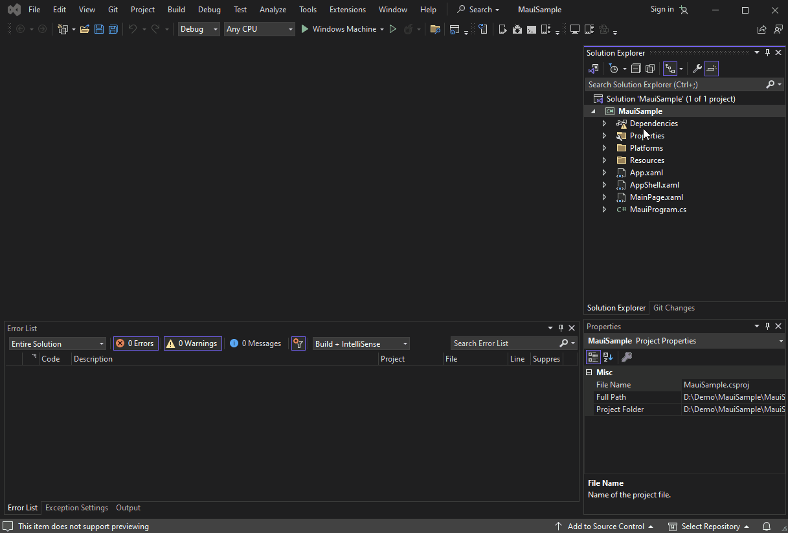
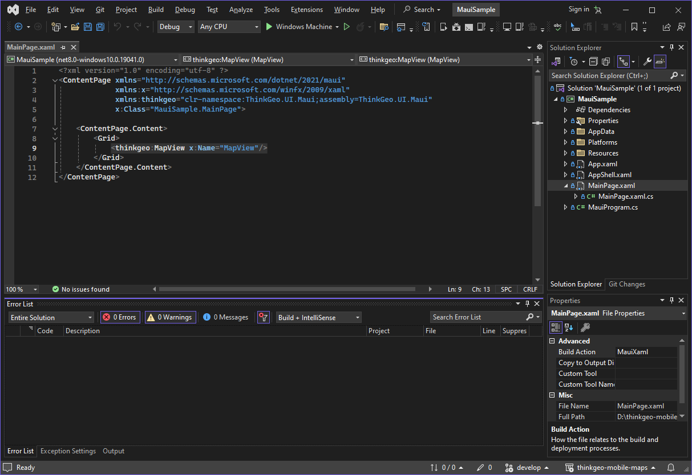
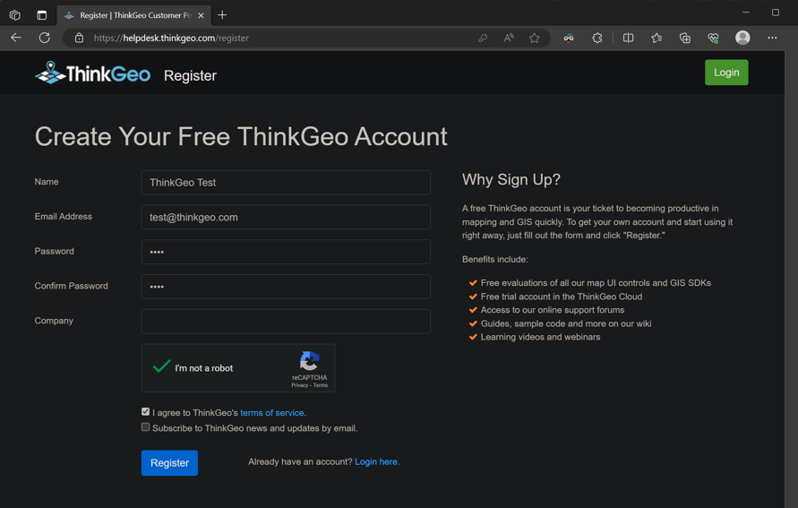

This guide is based on using Visual Studio 2022. However, with some minor adjustments, you can create a map using other IDEs, such as JetBrains Rider. Additionally, you can [display a map in a WPF project using VS Code](https://docs.thinkgeo.com/products/desktop-maps/quickstart-vscode/).

The project created in this guide is developed in .NET 8, and you can build the project to run on Android, iOS, Windows, and MacCatalyst using practically the same steps.

# Maui Maps Quick Start: Display a Simple Map using Maui

In this section, we'll show you how to create a visually appealing map with ThinkGeo Cloud Maps as the background. We highly recommend that you also take a look at the [How Do I Sample](https://gitlab.com/thinkgeo/public/thinkgeo-mobile-maps/-/tree/master/HowDoISample?ref_type=heads) on Gitlab, which contains numerous examples that cover virtually everything you can do with the control.

First, to begin working on the map, you'll need to create a .NET Maui project using Visual Studio 2022. Once that's done, we'll guide you through the process of adding the required packages and getting the map set up on the default form. Next, we'll show you how to add a background to the map.

## Step 1: Create a Maui Project
Create a C# Maui project with .NET 8.0. 


## Step 2: Add Nuget Packages: 

Install the **ThinkGeo.UI.Maui** NuGet package through NuGet package manager.

You can switch between the Beta Branch and Release Branch by checking/unchecking the "Include prerelease" checkbox. The Beta Branch contains the latest features/bug fixes, while the Release Branch is more stable and better tested.



## Step 3: Add the Map Control to `MainPage.xaml`

Add ThinkGeo.UI.Maui namespace to `MainPage.xaml` 

```xml
xmlns:thinkgeo="clr-namespace:ThinkGeo.UI.Maui;assembly=ThinkGeo.UI.Maui"
```

Add the map control within `Grid` element in `MainPage.xaml` file.

```xml
 <ContentPage.Content>
     <Grid>
         <thinkgeo:MapView x:Name="MapView" 
            MapUnit="Meter" SizeChanged="MapView_OnSizeChanged">
             <thinkgeo:MapView.MapTools>
                 <thinkgeo:ZoomMapTool/>
             </thinkgeo:MapView.MapTools>
         </thinkgeo:MapView>
     </Grid>
 </ContentPage.Content>
```



## Step 4: Add the ThinkGeo Background
Import the namespace at the top of 'MainPage.xaml.cs` file.

```csharp
using ThinkGeo.Core;
using ThinkGeo.UI.Maui;
```

Add the following code to the MapView_OnSizeChanged event, which is triggered when the map view is fully loaded and ready to use. (The key passed in ThinkGeoVectorOverlay is for test only, you can apply for your own key from [ThinkGeo Cloud](https://cloud.thinkgeo.com/clients.html))

We have set up a tile cache for the base overlay to improve performance. The cache retrieves tiles from the local disk instead of downloading them from the internet each time they are needed.

```csharp
private async void MapView_OnSizeChanged(object sender, EventArgs e)
{
    if (_initialized)
        return;
    _initialized = true;

    // Set the map's unit of measurement to meters(Spherical Mercator)
    MapView.MapUnit = GeographyUnit.Meter;

    // Add ThinkGeo Cloud Maps as the background 
    var backgroundOverlay = new ThinkGeoVectorOverlay
    {
        ClientId = "9ap16imkD_V7fsvDW9I8r8ULxgAB50BX_BnafMEBcKg~",
        ClientSecret = "vtVao9zAcOj00UlGcK7U-efLANfeJKzlPuDB9nw7Bp4K4UxU_PdRDg~~",
        MapType = ThinkGeoCloudVectorMapsMapType.Light,
        TileCache = new FileRasterTileCache(FileSystem.Current.CacheDirectory, "ThinkGeoVectorLight_RasterCache")
    };
    MapView.Overlays.Add(backgroundOverlay);

    MapView.IsRotationEnabled = true;

    // set up the map extent and refresh
    MapView.CenterPoint = new PointShape(450061, 1074668);
    MapView.MapScale = 74000000;

    await MapView.RefreshAsync();
}
```

## Step 5: Run the Sample & Register for Your Free Evaluation

The first time you run your application, if you have not installed a license, you may encounter a 'licenses not installed' exception. 


You can open the [ThinkGeo's Registration Website](https://helpdesk.thinkgeo.com/register), where you can create an account to begin a 30-day free evaluation. From there, you can download and install the Product Center and manage licenses for ThinkGeo products, please refer to the [ThinkGeo UI Maui License Guide](https://docs.thinkgeo.com/products/mobile-maps/license-guide/).  



Once you activate the 'ThinkGeo UI Maui' license to start your evaluation, you should be able to see the map with our Cloud Maps layer! You can double-click to zoom in, use the "Zoom Map Tool" to zoom in/out, and track zoom in by holding down the Shift key and tracking the map. Additionally, you can rotate the map by holding down the Alt key and dragging the map in Windows.


You can also double-click to zoom in, use the 'Zoom Map Tool' to zoom in/out, and rotate the map by holding down the Ctrl key and dragging it within the Android Emulator, or by pinching on the Android device.


You can double-click to zoom in, use the 'Zoom Map Tool' to zoom in/out, and rotate the map by holding down the Alt key and dragging it within the iOS Emulator, or by pinching on the iOS device as well.


## Summary

You now have a basic understanding of how to use the ThinkGeo UI Maui controls and can begin adding functionality to your own applications. Let's review what we've learned about the object relationships and how the pieces of ThinkGeo UI Maui work together:

1. A `MapView` is the fundamental control that contains all the other objects used to determine how the map is rendered.
2. A `MapView` has multiple `Overlays`, and each `Overlay` corresponds to a tier of images displayed on the map control.
3. The `MapUnit` (feet, meters, decimal degrees, etc.) and `CurrentExtent` need to be correctly set for the `Map` control.

Congratulations, you are now in an excellent position to review the [How Do I Sample](https://gitlab.com/thinkgeo/public/thinkgeo-mobile-maps) and explore other features.
