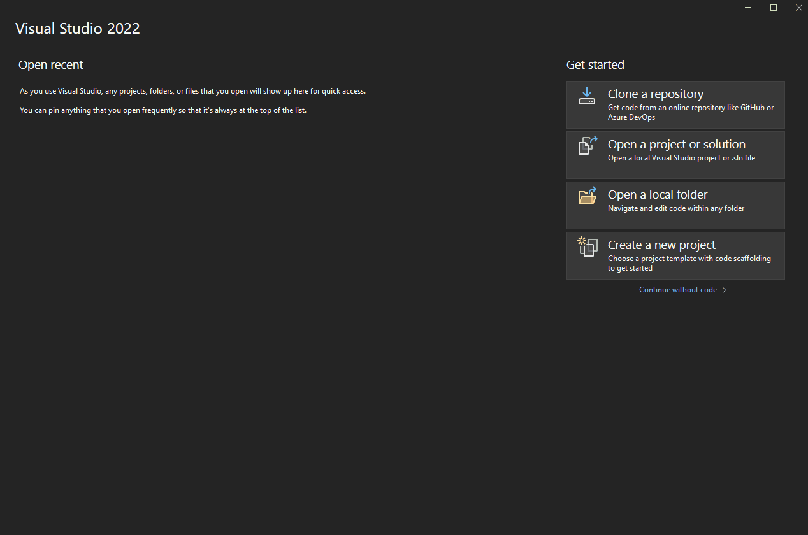
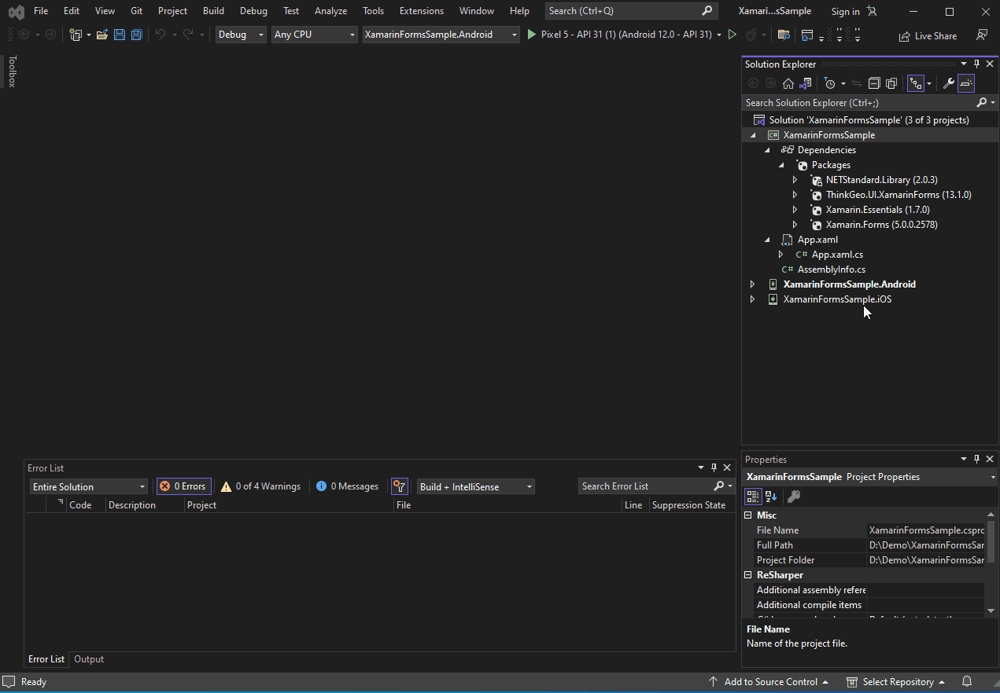
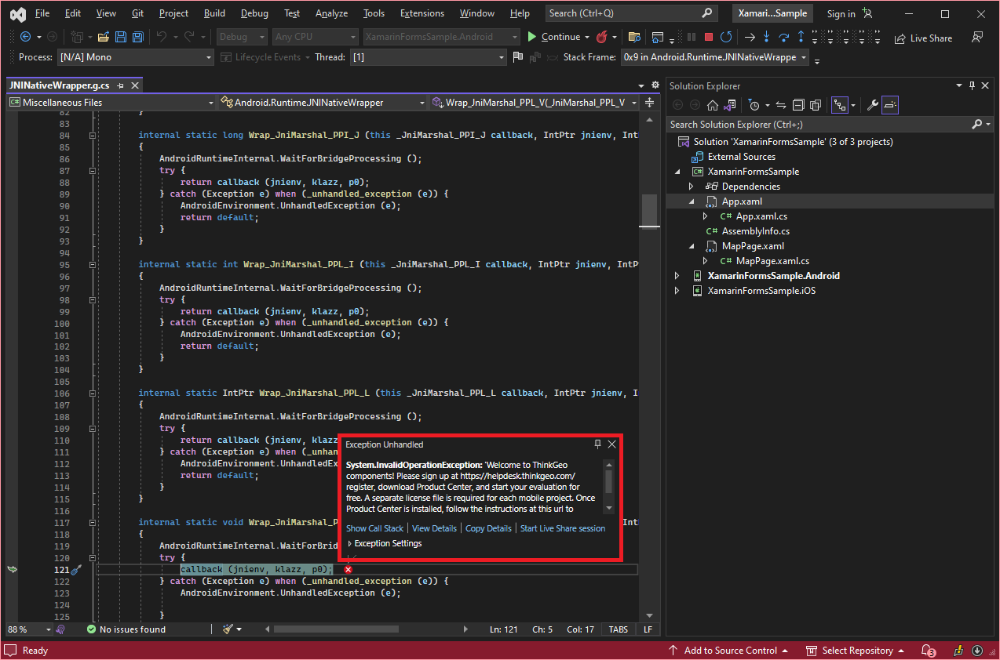
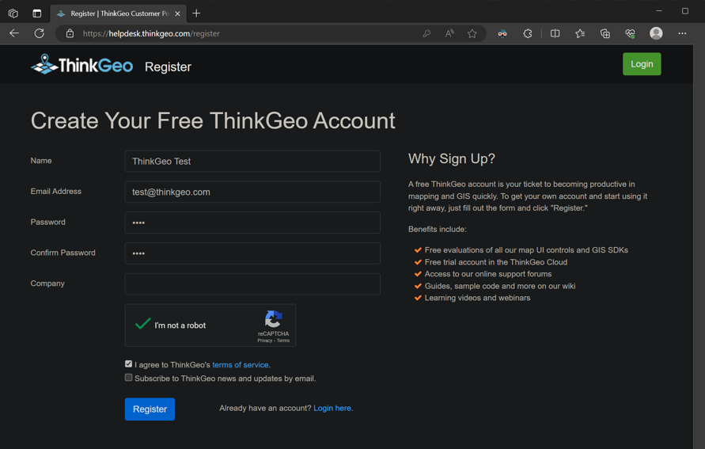
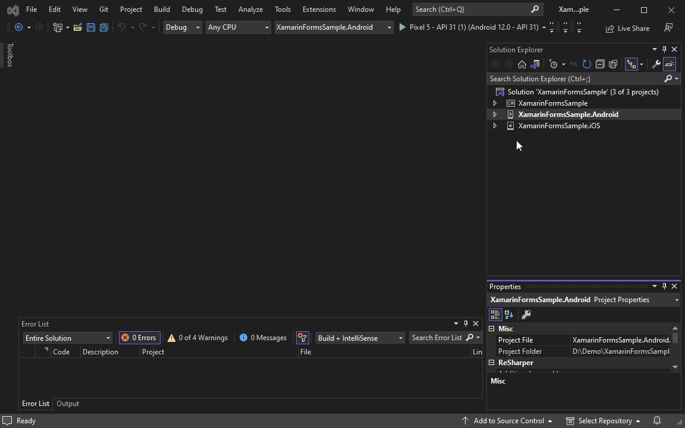
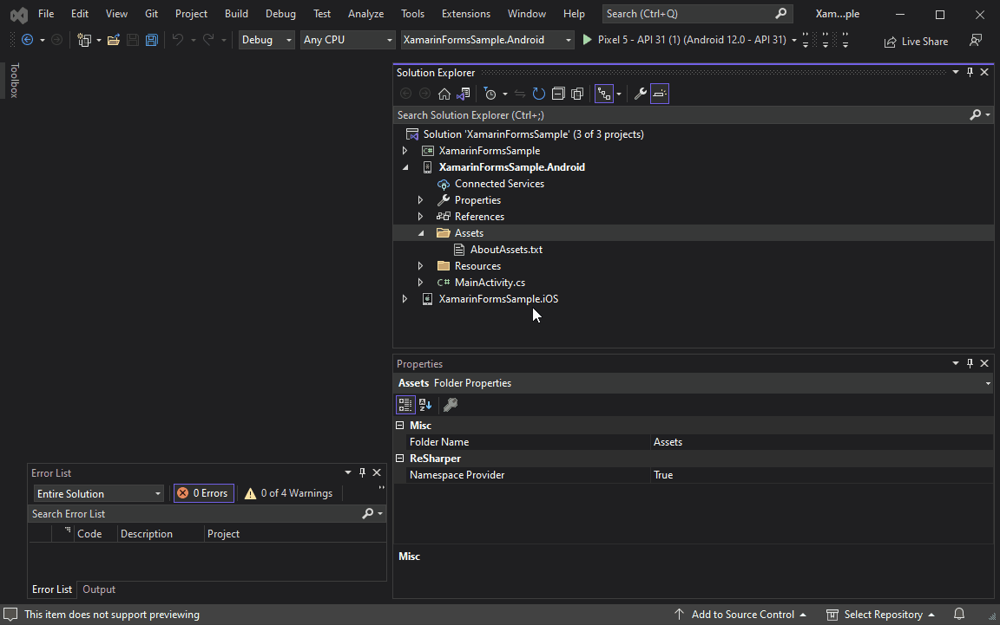
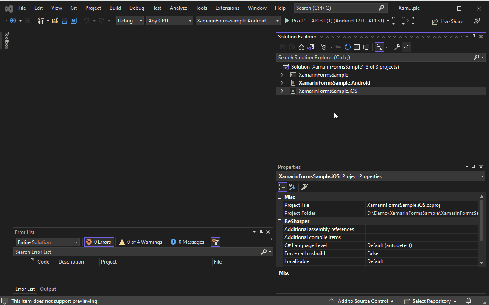
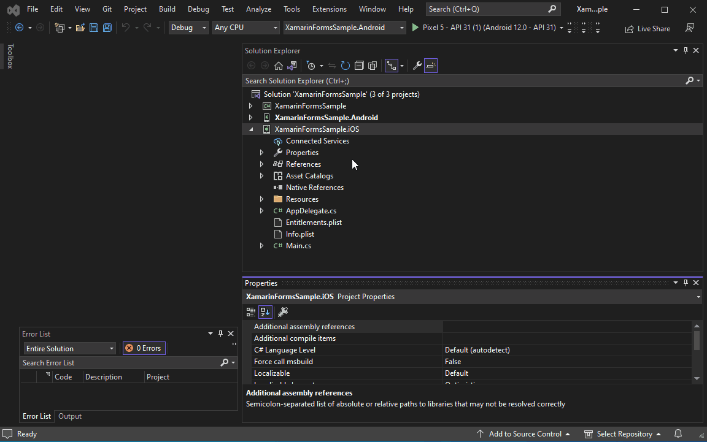

# Quick Start Guide

If you're new to ThinkGeo's Mobile Edition, we suggest you download ThinkGeo Maps from the App Store (for iOS) or Google Play (for Android). This app features approximately 100 'HowDoI' samples that demonstrate the capabilities of ThinkGeo's Xamarin Mapping Components. The source code of this app can be found [here](https://gitlab.com/thinkgeo/public/thinkgeo-mobile-maps/-/tree/master/samples/xamarin-forms/HowDoISample). 

[](https://apps.apple.com/us/app/igis/id1559817900) [](https://play.google.com/store/apps/details?id=com.thinkgeo.androidhowdoi)

## Quick Start: Display a Simple Map on Android / iOS

This guide will introduce you to ThinkGeo Mobile Maps by helping you set up a nice-looking map. By the end of this guide, you will have a basic understanding of how to use the Mobile Maps controls.

### Step 1: Set Up Prerequisites

In order to develop and debug Xamarin Android / iOS applications, you'll need to have a few prerequisites set up. 

#### Android Prerequisites

* Xamarin
* The Android SDK
* An Android emulator

Here are a few handy links for installation and setup of these prerequisites using Visual Studio:

[Xamarin for Visual Studio](https://docs.microsoft.com/en-us/xamarin/get-started/installation)

[Android SDK](https://docs.microsoft.com/en-us/xamarin/android/get-started/installation/android-sdk)

[Android Emulator](https://docs.microsoft.com/en-us/xamarin/android/get-started/installation/android-emulator/device-manager)

#### iOS Prerequisites
To develop on Mac, you need:

* XCode, which provides iOS emulator.
* A development IDE, it could be Visual Studio for Mac, JetBrains Rider or others.

To develop on Windows, you need:

* A development IDE, such as Visual Studio or JetBrains Rider
* A Mac machine with XCode installed on the same network as your Windows machine.


### Step 2: Set Up a New Project

Once these prerequisites have been installed, you'll need to create a new **Xamarin Forms** project using Visual Studio.



### Step 3: Add NuGet Packages

You'll need to install the **ThinkGeo.UI.XamarinForms** NuGet package to **XamarinFormsSample** project, **ThinkGeo.UI.XamarinForms.Android** NuGet package to **XamarinFormsSample.Android** project, **ThinkGeo.UI.XamarinForms.iOS** NuGet package to **XamarinFormsSample.iOS** project. We strongly suggest you use your editor's **Manage Nuget Package** if possible.  Before adding ThinkGeo Nuget packages, you need to update the **Xamarin.Forms** Nuget Package above Version 5.0.0.2578.


### Step 4: Set up the App Template 

- Delete the unnecessary folders and files to make the sample clean. After the cleaning, the XamarinFormsSample project should be:


- Add a **MapPage** to the **XamarinFormsSample** project:



### Step 5: Add the Map Control to `MapPage.xaml`

```xml
<ContentPage xmlns="http://xamarin.com/schemas/2014/forms"
             xmlns:x="http://schemas.microsoft.com/winfx/2009/xaml"
             x:Class="XamarinFormsSample.MapPage"
             xmlns:thinkgeo="clr-namespace:ThinkGeo.UI.XamarinForms;assembly=ThinkGeo.UI.XamarinForms"
             >
    <Grid>
        <thinkgeo:MapView x:Name="mapView" VerticalOptions="FillAndExpand"/>
    </Grid>
</ContentPage>
```

### Step 6: Add Namespaces and Map Background Overlay to `MapPage.xaml.cs`

- Add the required usings and the Map Background Overlay to the `MapPage.xaml.cs` file:

```csharp
using System.IO;
using ThinkGeo.Core;
using ThinkGeo.UI.XamarinForms;
using Xamarin.Essentials;
using Xamarin.Forms;

namespace XamarinFormsSample
{
    public partial class MapPage : ContentPage
    {   
        public MapPage()
        {
            InitializeComponent();            
        }
        protected override async void OnAppearing()
        {
            base.OnAppearing();
            mapView.MapUnit = GeographyUnit.Meter;

            var thinkGeoCloudVectorMapsOverlay = new ThinkGeoCloudVectorMapsOverlay("9ap16imkD_V7fsvDW9I8r8ULxgAB50BX_BnafMEBcKg~", "vtVao9zAcOj00UlGcK7U-efLANfeJKzlPuDB9nw7Bp4K4UxU_PdRDg~~", ThinkGeoCloudVectorMapsMapType.Light);
            mapView.Overlays.Add(thinkGeoCloudVectorMapsOverlay);
            thinkGeoCloudVectorMapsOverlay.TileCache =
            new FileRasterTileCache(Path.Combine(FileSystem.CacheDirectory, "ThinkGeoCloudMapsOverlay"), "clientId");

            mapView.RotationEnabled = true;
            mapView.MapScale = mapView.ZoomLevelSet.ZoomLevel02.Scale;
            mapView.CenterPoint = new PointShape(0, 0);
            await mapView.RefreshAsync();
        }
    }
}
```
### Step 7: Set the MapPage to be the MainPage of the App

- Add the required usings and set the MapPage to be the MainPage of the App in the `App.xaml.cs` file:

```csharp
using Xamarin.Forms;

namespace XamarinFormsSample
{
    public partial class App : Application
    {
        public App()
        {
            InitializeComponent();
            MainPage = new XamarinFormsSample.MapPage();
        }

        protected override void OnStart()
        {
        }

        protected override void OnSleep()
        {
        }

        protected override void OnResume()
        {
        }
    }
}
```

### Step 8: Run the Sample & Register For Your Free Evaluation

The first time you run the application, you will be presented with an error requiring a ThinkGeo license to proceed with running the app. 



In order to register and generate a license for this project, you'll need to take the following steps:

1. Open [ThinkGeo's Registration Website](https://helpdesk.thinkgeo.com/register), where you can create an account to begin a 30-day free evaluation. 
2. From there, you can download and install the Product Center and manage licenses for ThinkGeo products.



### Step 9: Creating and Activating an Android / iOS License

####  Android License
1. Click on the `ThinkGeo UI Android` for Android tab and activate an evaluation license(or Activate License if you have already purchased a full license) in `ThinkGeo Product Center`.
2. To generate a runtime license for the sample app, you'll need to set the package name as **com.thinkgeo.xamarinforms.android** for your Android sample project. In Visual Studio, this can be found by right-clicking on the `XamarinFormsSample.Android` project in the solution explorer and navigating to `Properties -> Android Manifest -> Package Name`.
3. Copy the Package Name to the Runtime License input box to the right of the Product Center and click `Create`. Save the newly created license to the Assets folder of the solution (`XamarinFormsSample.Android\Assets`).



4. Add the license to the project in the solution explorer by right-clicking on the `Assets` folder and selecting `Add -> Existing Item`.
5. Right-click on the license and select `Properties`. Ensure that the `Build Action` is set to `AndroidAsset`



####  iOS License
1. Click the `ThinkGeo UI iOS` for iOS tab and activate an evaluation license(or Activate License if you have already purchased a full license) in `ThinkGeo Product Center`. Now you can see a textbox with a text placeholder `Bundle Identifier` on the right.
2. To generate a runtime license for the sample app, you'll need to set the Bundle Identifier name as **com.thinkgeo.xamarinforms.ios** for your iOS sample project. In Visual Studio, this can be found by right-clicking on the `XamarinFormsSample.iOS` project in the solution explorer and navigating to `Properties -> iOS Manifest -> info.plist -> Bundle Identifier`. 
3. Copy the Bundle Identifier Name to the Runtime License input box to the right of the Product Center and click `Create`. Save the newly created license to the solution's `XamarinFormsSample.iOS` project root folder.



4. Add the license to the project in the solution explorer by right-clicking the project and selecting `Add -> Existing Item...`
5. Right-click on the license and select `Properties`. Ensure that the `Build Action` is set to `BundleResource`.
6. Register `ThinkGeo.UI.XamarinForms.iOS` service by adding the following code in the `FinishedLaunching` method of the `AppDelegate.cs` file

```csharp
Xamarin.Forms.DependencyService.Register<ThinkGeo.UI.XamarinForms.iOS.iOSMapViewAdapter>();
```



### Step 10: Show the Map

Once you activate the `ThinkGeo UI Android` or `ThinkGeo UI iOS` license to start your evaluation, you should be able to see the map with our Cloud Maps layer! You can double-click to zoom in, and track zoom in by holding down the Ctrl key and tracking the map.

Running on iOS              |   Running on Android
:-------------------------:|:-------------------------:
|

### Summary

You now have a basic understanding of how to use the ThinkGeo Map controls and can begin adding functionality to your own applications. Let's review what we've learned about the object relationships and how the pieces of ThinkGeo UI work together:

1. A `MapView` is the fundamental control that contains all the other objects used to determine how the map is rendered.
1. A `MapView` has multiple Overlays, and each Overlay corresponds to a tier of images displayed on the map control.
1. The `MapUnit` (feet, meters, decimal degrees, etc.) and `CurrentExtent` need to be correctly set for the Map control.

Congratulations, you are now in an excellent position to review the [How Do I Sample](https://gitlab.com/thinkgeo/public/thinkgeo-mobile-maps/-/tree/master/samples/xamarin-forms/HowDoISample) and explore other features.
