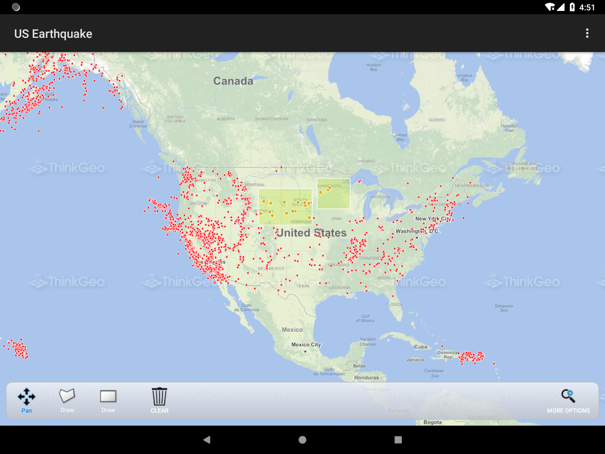

# Earthquake Statistics Sample Template for Android

### Description

The Earthquake Statistics sample template is a statistical report system for earthquakes that have occurred in the past few years across the United States. It can help you generate infographics and analyze the severely afflicted areas, or used as supporting evidence when recommending measures to minimize the damage in future quakes.

### Requirements
This sample makes use of the following NuGet Packages

[MapSuite 10.0.0.0](http:mapsuite.nuget)

### About the Code

Working...

### Getting Help

[Map Suite Android Wiki Resources](http://wiki.thinkgeo.com/wiki/map_suite_android_edition)

[Map Suite Android Product Description](http://thinkgeo.com/map-suite-developer-gis/android-edition/)

[ThinkGeo Community Site](http://community.thinkgeo.com/)

[ThinkGeo Web Site](http://www.thinkgeo.com)

### Key APIs
This example makes use of the following APIs:

Working...

### About Map Suite
Map Suite is a set of powerful development components and services for the .Net Framework.

### About ThinkGeo
ThinkGeo is a GIS (Geographic Information Systems) company founded in 2004 and located in Frisco, TX. Our clients are in more than 40 industries including agriculture, energy, transportation, government, engineering, software development, and defense.
