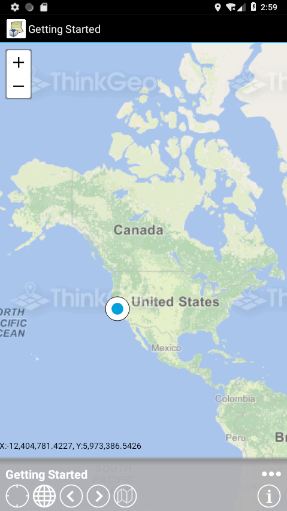

# Getting Started Sample for Android

### Description

This samples shows you how to get started building your first application with the Map Suite Android Edition.

Please refer to [Wiki](http://wiki.thinkgeo.com/wiki/map_suite_mobile_for_android) for the details.



### Requirements
This sample makes use of the following NuGet Packages

[MapSuite 10.0.0](https://www.nuget.org/packages?q=ThinkGeo)

### About the Code

```csharp
double mapResolution = Math.Max(CustomMapView.Current.CurrentExtent.Width / CustomMapView.Current.Width, CustomMapView.Current.CurrentExtent.Height / CustomMapView.Current.Height);
int radius = (int)(gpsLocation.Accuracy / mapResolution);
((GpsMarker)locationMarker).AccuracyRadius = radius;
locationMarker.Position = location;
if (CustomMapView.Current.Width != 0 && CustomMapView.Current.Height != 0)
{
  CustomMapView.Current.CenterAt(location);
}
```

### Getting Help

- [Map Suite mobile for Android Wiki Resources](http://wiki.thinkgeo.com/wiki/map_suite_mobile_for_android)
- [Map Suite mobile for Android Product Description](https://thinkgeo.com/ui-controls#mobile-platforms)
- [ThinkGeo Community Site](http://community.thinkgeo.com/)
- [ThinkGeo Web Site](http://www.thinkgeo.com)

### Key APIs
This example makes use of the following APIs:

- [ThinkGeo.MapSuite.Android.Popup](http://wiki.thinkgeo.com/wiki/api/thinkgeo.mapsuite.android.popup)
- [ThinkGeo.MapSuite.Android.GpsMarker](http://wiki.thinkgeo.com/wiki/api/thinkgeo.mapsuite.android.gpsmarker)
- [ThinkGeo.MapSuite.Android.MarkerOverlay](http://wiki.thinkgeo.com/wiki/api/thinkgeo.mapsuite.android.markeroverlay)
- [ThinkGeo.MapSuite.Android.PopupOverlay](http://wiki.thinkgeo.com/wiki/api/thinkgeo.mapsuite.android.popupoverlay)

### About Map Suite
Map Suite is a set of powerful development components and services for the .Net Framework.

### About ThinkGeo
ThinkGeo is a GIS (Geographic Information Systems) company founded in 2004 and located in Frisco, TX. Our clients are in more than 40 industries including agriculture, energy, transportation, government, engineering, software development, and defense.
