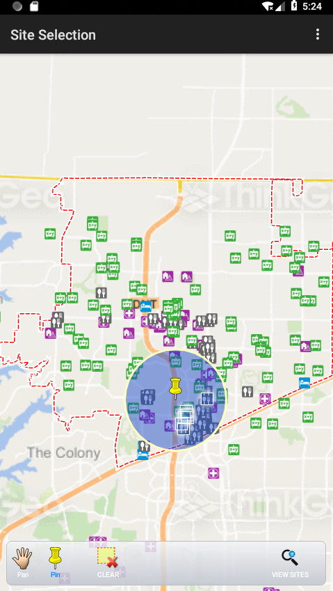

# Site Selection Sample for Android

### Description

The Site Selection sample template allows you to view, understand, interpret, and visualize spatial data in many ways that reveal relationships, patterns, and trends. In the example illustrated, the user can apply the features of GIS to analyze spatial data to efficiently choose a suitable site for a new retail outlet.

Please refer to [Wiki](http://wiki.thinkgeo.com/wiki/map_suite_mobile_for_android) for the details.



### Requirements
This sample makes use of the following NuGet Packages

[MapSuite 10.0.0](https://www.nuget.org/packages?q=ThinkGeo)

### About the Code

```csharp
MultipolygonShape bufferResultShape = highlightCenterMarkerLayer.InternalFeatures[0].GetShape().Buffer(FilterConfiguration.BufferValue, MapUnit, FilterConfiguration.BufferDistanceUnit);
FilterConfiguration.QueryFeatureLayer.Open();
Collection<Feature> filterResultFeatures = FilterConfiguration.QueryFeatureLayer.FeatureSource.GetFeaturesWithinDistanceOf(bufferResultShape, MapUnit, DistanceUnit.Meter, 0.1, ReturningColumnsType.AllColumns);
highlightAreaLayer.InternalFeatures.Add(new Feature(bufferResultShape));
```

### Getting Help

- [Map Suite mobile for Android Wiki Resources](http://wiki.thinkgeo.com/wiki/map_suite_mobile_for_android)
- [Map Suite mobile for Android Product Description](https://thinkgeo.com/ui-controls#mobile-platforms)
- [ThinkGeo Community Site](http://community.thinkgeo.com/)
- [ThinkGeo Web Site](http://www.thinkgeo.com)

### Key APIs
This example makes use of the following APIs:

- [ThinkGeo.MapSuite.Shapes.AreaBaseShape](http://wiki.thinkgeo.com/wiki/api/thinkgeo.mapsuite.shapes.areabaseshape)
- [ThinkGeo.MapSuite.Layers.FeatureSource](http://wiki.thinkgeo.com/wiki/api/thinkgeo.mapsuite.layers.featuresource)
- [ThinkGeo.MapSuite.Layers.InMemoryFeatureLayer](http://wiki.thinkgeo.com/wiki/api/thinkgeo.mapsuite.layers.inmemoryfeaturelayer)

### FAQ
- __Q: How do I make background map work?__
A: Backgrounds for this sample are powered by ThinkGeo Cloud Maps and require a Client ID and Secret. These were sent to you via email when you signed up with ThinkGeo, or you can register now at https://cloud.thinkgeo.com. Once you get them, please update the code in method LoadOverlays() in SampleMapView.cs.

### About Map Suite
Map Suite is a set of powerful development components and services for the .Net Framework.

### About ThinkGeo
ThinkGeo is a GIS (Geographic Information Systems) company founded in 2004 and located in Frisco, TX. Our clients are in more than 40 industries including agriculture, energy, transportation, government, engineering, software development, and defense.
