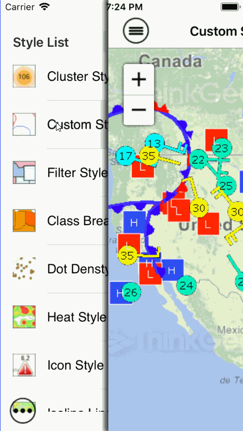

# Analyzing Visualization Sample for iOS

### Description

This samples shows you how to explore the different styles available to help you analyze and visualize your data.

Please refer to [Wiki](http://wiki.thinkgeo.com/wiki/map_suite_mobile_for_ios) for the details.



### Requirements
This sample makes use of the following NuGet Packages

[MapSuite 10.0.0](https://www.nuget.org/packages?q=ThinkGeo)

### About the Code

```CSharp
double[] classBreakValues = { 0, 814180.0, 1328361.0, 2059179.0, 2967297.0, 4339367.0, 5303925.0, 6392017.0, 8791894.0 };

GeoColor fromColor = GeoColor.FromArgb(255, 116, 160, 255);
GeoColor toColor = GeoColor.FromArgb(255, 220, 52, 56);
Collection<GeoColor> familyColors = GeoColor.GetColorsInQualityFamily(fromColor, toColor, 10, ColorWheelDirection.CounterClockwise);

ClassBreakStyle classBreakStyle = new ClassBreakStyle("Population", BreakValueInclusion.IncludeValue);
GeoColor outlineColor = GeoColor.FromHtml("#f05133");
for (int i = 0; i < classBreakValues.Length; i++)
{
    GeoColor fillColor = new GeoColor(200, familyColors[i]);
    AreaStyle areaStyle = AreaStyles.CreateSimpleAreaStyle(fillColor, outlineColor, 1);
    classBreakStyle.ClassBreaks.Add(new ClassBreak(classBreakValues[i], areaStyle));
}
return classBreakStyle;
```

### Getting Help

[Map Suite mobile for iOS Wiki Resources](http://wiki.thinkgeo.com/wiki/map_suite_mobile_for_ios)

[Map Suite mobile for iOS Product Description](https://thinkgeo.com/ui-controls#mobile-platforms)

[ThinkGeo Community Site](http://community.thinkgeo.com/)

[ThinkGeo Web Site](http://www.thinkgeo.com)

### Key APIs
This example makes use of the following APIs:

- [ThinkGeo.MapSuite.iOS.MapView](http://wiki.thinkgeo.com/wiki/api/thinkgeo.mapsuite.ios.mapview)
- [ThinkGeo.MapSuite.Styles.ClassBreakStyle](http://wiki.thinkgeo.com/wiki/api/thinkgeo.mapsuite.styles.classbreakstyle)
- [ThinkGeo.MapSuite.Layers.HeatStyle](http://wiki.thinkgeo.com/wiki/api/thinkgeo.mapsuite.layers.heatstyle)
- [ThinkGeo.MapSuite.Styles.DotDensityStyle](http://wiki.thinkgeo.com/wiki/api/thinkgeo.mapsuite.styles.dotdensitystyle)

### FAQ
- __Q: How do I make background map work?__
A: Backgrounds for this sample are powered by ThinkGeo Cloud Maps and require a Client ID and Secret. These were sent to you via email when you signed up with ThinkGeo, or you can register now at https://cloud.thinkgeo.com. Once you get them, please update the code in method InitializeMap() in all ViewController classes.

### About Map Suite
Map Suite is a set of powerful development components and services for the .Net Framework.

### About ThinkGeo
ThinkGeo is a GIS (Geographic Information Systems) company founded in 2004 and located in Frisco, TX. Our clients are in more than 40 industries including agriculture, energy, transportation, government, engineering, software development, and defense.
