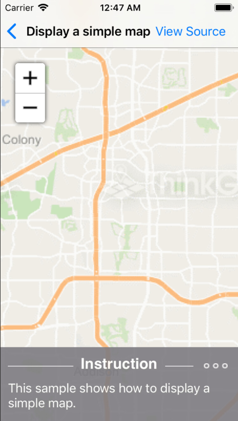

# How Do I Sample for iOS

### Description

The "How Do I?" samples collection is a comprehensive set containing dozens of interactive samples.

Please refer to [Wiki](http://wiki.thinkgeo.com/wiki/map_suite_mobile_for_ios) for the details.



### Requirements

This sample makes use of the following NuGet Packages

[MapSuite 10.0.0](https://www.nuget.org/packages?q=ThinkGeo)

### About the Code

```CSharp
MapView.MapUnit = GeographyUnit.Meter;
MapView.ZoomLevelSet = new ThinkGeoCloudMapsZoomLevelSet();
MapView.CurrentExtent = new RectangleShape(-10777311, 3913534, -10776306, 3911735);

/*===========================================
  Backgrounds for this sample are powered by ThinkGeo Cloud Maps and require
  a Client ID and Secret. These were sent to you via email when you signed up
  with ThinkGeo, or you can register now at https://cloud.thinkgeo.com.
===========================================*/
ThinkGeoCloudRasterMapsOverlay thinkGeoCloudMapsOverlay = new ThinkGeoCloudRasterMapsOverlay();
MapView.Overlays.Add(thinkGeoCloudMapsOverlay);
MapView.Refresh();
```

### Getting Help

[Map Suite mobile for iOS Wiki Resources](http://wiki.thinkgeo.com/wiki/map_suite_mobile_for_ios)

[Map Suite mobile for iOS Product Description](https://thinkgeo.com/ui-controls#mobile-platforms)

[ThinkGeo Community Site](http://community.thinkgeo.com/)

[ThinkGeo Web Site](http://www.thinkgeo.com)

### Key APIs

This example makes use of the following APIs:

- [ThinkGeo.MapSuite.GeographyUnit](http://wiki.thinkgeo.com/wiki/api/thinkgeo.mapsuite.geographyunit)
- [ThinkGeo.MapSuite.iOS.MapView](http://wiki.thinkgeo.com/wiki/api/thinkgeo.mapsuite.ios.mapview)

### FAQ
- __Q: How do I make background map work?__
A: Backgrounds for this sample are powered by ThinkGeo Cloud Maps and require a Client ID and Secret. These were sent to you via email when you signed up with ThinkGeo, or you can register now at https://cloud.thinkgeo.com. Once you get them, please update the code in method ViewDidLoad() in all  ViewController classes.

### About Map Suite

Map Suite is a set of powerful development components and services for the .Net Framework.

### About ThinkGeo

ThinkGeo is a GIS (Geographic Information Systems) company founded in 2004 and located in Frisco, TX. Our clients are in more than 40 industries including agriculture, energy, transportation, government, engineering, software development, and defense.
