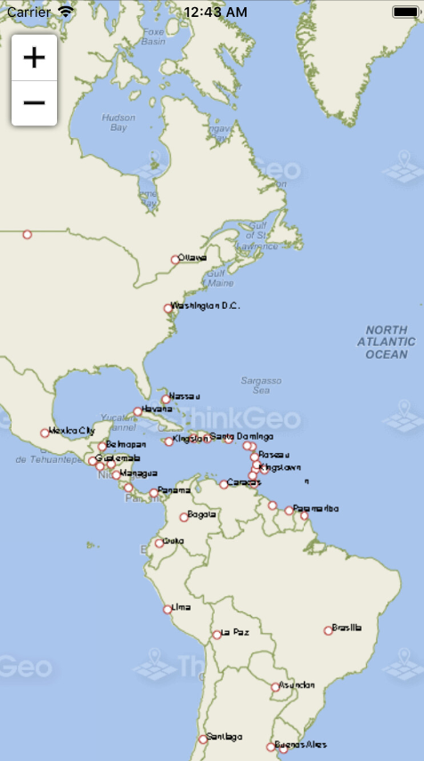

# Quickstart Sample for iOS

### Description
The Map Suite iOS QuickStart Guide will guide you through the process of creating a sample application and will help you become familiar with Map Suite. The QuickStart Guide supports iOS 10.0.0.0 and higher and will show you how to create an iOS application.

Please refer to [Wiki](http://wiki.thinkgeo.com/wiki/map_suite_mobile_for_ios) for the details.



### Requirements
This sample makes use of the following NuGet Packages

[MapSuite 10.0.0](https://www.nuget.org/packages?q=ThinkGeo)

### About the Code

```csharp
mapView.MapUnit = GeographyUnit.Meter;
mapView.ZoomLevelSet = new ThinkGeoCloudMapsZoomLevelSet();

/*===========================================
  Backgrounds for this sample are powered by ThinkGeo Cloud Maps and require
  a Client ID and Secret. These were sent to you via email when you signed up
  with ThinkGeo, or you can register now at https://cloud.thinkgeo.com.
===========================================*/
ThinkGeoCloudRasterMapsOverlay thinkGeoCloudMapsOverlay = new ThinkGeoCloudRasterMapsOverlay();
// Add a ThinkGeoCloudMapsOverlay.
mapView.Overlays.Add("ThinkGeoCloudMapsOverlay", thinkGeoCloudMapsOverlay);
```

### Getting Help

- [Map Suite mobile for iOS Wiki Resources](http://wiki.thinkgeo.com/wiki/map_suite_mobile_for_ios)
- [Map Suite mobile for iOS Product Description](https://thinkgeo.com/ui-controls#mobile-platforms)
- [ThinkGeo Community Site](http://community.thinkgeo.com/)
- [ThinkGeo Web Site](http://www.thinkgeo.com)

### Key APIs
This example makes use of the following APIs:

- [ThinkGeo.MapSuite.GeographyUnit](http://wiki.thinkgeo.com/wiki/api/thinkgeo.mapsuite.geographyunit)
- [ThinkGeo.MapSuite.iOS.MapView](http://wiki.thinkgeo.com/wiki/api/thinkgeo.mapsuite.ios.mapview)
- [ThinkGeo.MapSuite.iOS.WorldStreetAndImageryOverlay](http://wiki.thinkgeo.com/wiki/api/thinkgeo.mapsuite.ios.worldstreetandimageryoverlay)

### About Map Suite
Map Suite is a set of powerful development components and services for the .Net Framework.

### About ThinkGeo
ThinkGeo is a GIS (Geographic Information Systems) company founded in 2004 and located in Frisco, TX. Our clients are in more than 40 industries including agriculture, energy, transportation, government, engineering, software development, and defense.
