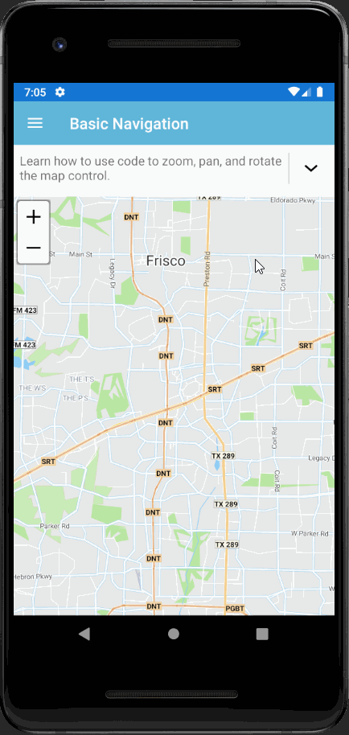

# How Do I Sample for Xamarin.Forms

The “How Do I?” samples collection is a comprehensive set containing dozens of interactive samples. Available in C#, these samples are designed to hit all the highlights of ThinkGeo UI, from simply adding a layer to a map to performing spatial queries and applying a thematic style. Consider this collection your “encyclopedia” of all the ThinkGeo UI basics and a great starting place for new users.

This sample has been deployed in App Store(iOS) and Google Play(Android), please download it from the following links if you are interested.

 

